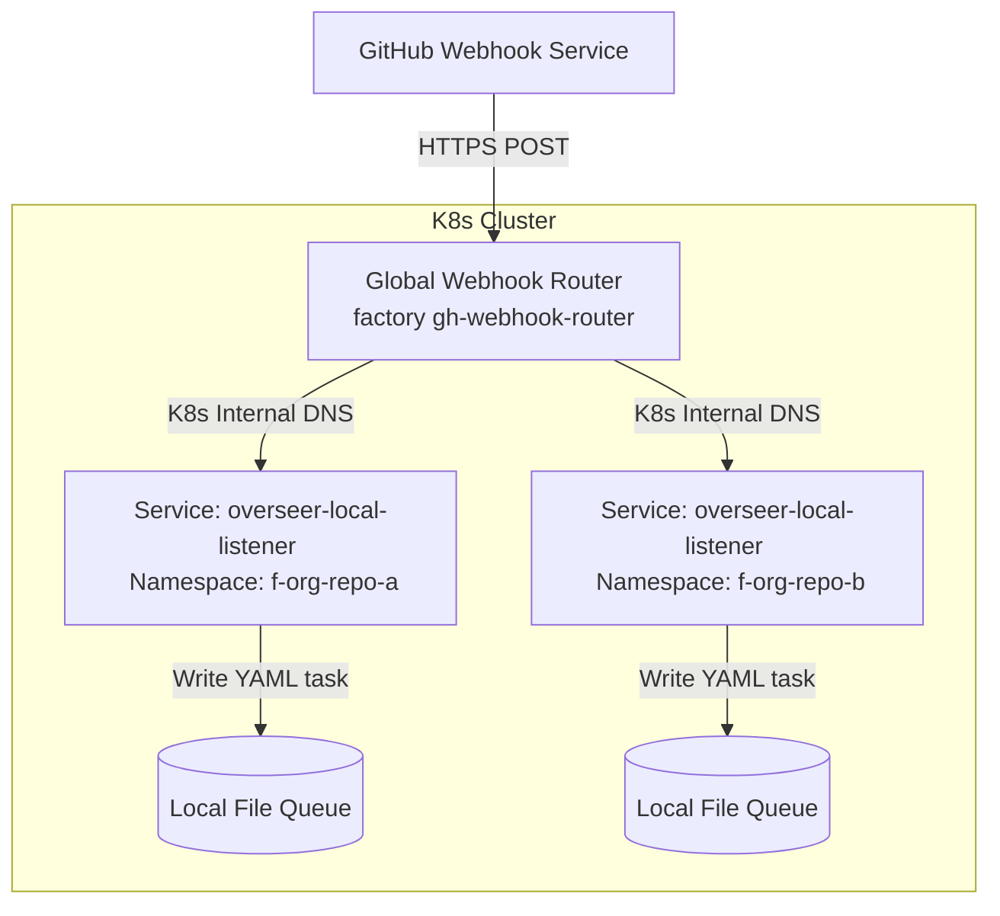
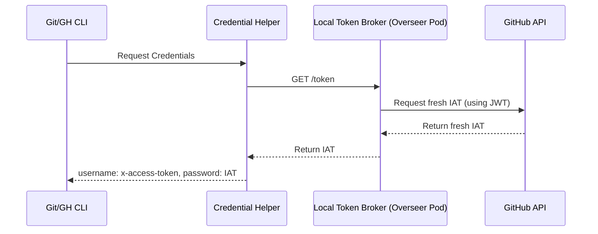

# Design Document: Hosting Overseer as a GitHub App

This document describes the design, configuration, authentication flows, and identity models implemented to support running the **Overseer** and **Factory** system as an event-driven **GitHub App**.

---

## 1. Webhook Routing & Scale (Global Webhook Router)

GitHub Apps send all webhook payloads to a single configured endpoint. To maintain isolated, repository-specific environments (namespace-per-repo) without manual webhook setup on each repository, we use a global router.



### Flow description
1. The Global Router receives webhooks at a single ingress endpoint.
2. It validates the payload signature using the App's configured Webhook Secret.
3. It extracts the target repository from the payload (`repository.full_name`, e.g. `owner/repo-a`).
4. It computes the target namespace using a deterministic slugification formula:
   * Format: `f-<slug>` (or `f-<truncated-slug>-<hash>` if the length exceeds 63 characters).
5. It forwards the payload via internal K8s DNS to the namespace-specific local listener service:
   `POST http://overseer-local-listener.f-owner-repo-a.svc.cluster.local:8080/events`
6. The local listener writes the task straight to its local queue directory (`/workspaces/overseer/queues/incoming`).

### Namespace Slugification & Hashing Formula
To comply with Kubernetes namespace character limits (max 63 characters) and prevent collisions when truncating, the namespace name is resolved as:
1. Parse the repository path (`owner/repo`) and convert to lowercase.
2. Replace non-alphanumeric characters with hyphens.
3. If the resulting string `f-<slug>` is `<= 63` characters, use it.
4. If it is `> 63` characters:
   * Calculate a 32-bit FNV-1a hash of the original repository path (yielding 8 hex characters).
   * Truncate the slug so that `f-<truncated-slug>-<hash>` fits exactly within the 63-character limit (the slug is truncated to 52 characters).

Both the `gh-webhook-router` and the `OverseerController` use this exact formula to resolve namespaces deterministically.

### Handling Forks
* **Fork Isolation**: When a developer installs the App on their personal fork (e.g., `developer/repo`), the slugification formula maps it to a unique namespace: `f-developer-repo`. The fork gets its own isolated Overseer pod and PVC.
* **PRs from Forks to Upstream**: When a PR is opened from a fork to the upstream repo, the webhook is sent under the **upstream** repo's context. 
  * The event is routed to the **upstream** namespace.
  * Git pushes back to the fork's branch are authenticated using the upstream App's Installation Access Token. GitHub automatically grants temporary write access to the fork's head branch for the PR (provided the fork author has enabled `"Allow edits from maintainers"` on the PR).

---

## 2. Automatic Onboarding Flow

When a user installs the GitHub App on a new repository, the Global Webhook Router automatically registers and bootstraps the new repository environment dynamically.

```
[User installs App on repo]
            │
            ▼ (GitHub)
   [ installation event ]
            │
            ▼
┌──────────────────────────────────────┐
│  Global Webhook Router               │
│  1. Receives 'added' repositories    │
│  2. Calls Kubernetes API             │
└───────────┬──────────────────────────┘
            │
            ▼ (K8s API)
┌──────────────────────────────────────┐
│  Kubernetes Cluster                  │
│  1. Creates "Overseer" Custom Res    │  ◄── Ex: metadata.name: f-org-repo-c
│  2. OverseerReconciler wakes up      │  
│  3. Namespace "f-org-repo-c" created │
│  4. Local listener & sandbox started │
└──────────────────────────────────────┘
```

### How Onboarding works:
1. **GitHub Installation Event**: When the App is installed on a new repo, GitHub sends an `installation` (action `created`) or `installation_repositories` (action `added`) event.
2. **CRD Creation**: The Global Router processes these events. For each newly added repository, it makes a Kubernetes API call to create a matching `Overseer` Custom Resource:
   ```yaml
   apiVersion: overseer.gemini.google.com/v1alpha1
   kind: Overseer
   metadata:
     name: <slugified-repo-name>
     namespace: overseer-system
   spec:
     repoURL: https://github.com/owner/repo
     pollInterval: 30m
   ```
3. **Reconciliation**: The `OverseerReconciler` detects the new resource and deploys the target namespace, secrets, local webhook listener service, and the background loop runner automatically.

---

## 3. Webhook Event to Queue Integration

To preserve the simpler, file-based queue system (`overseer/queues`), incoming webhooks do not trigger tasks immediately. Instead, they are parsed and written to disk.

1. **Webhook Event Received**: The local listener inside the Overseer pod (`factory gh-webhook-handler`) receives the event (e.g. `issues.labeled` with `factory`).
2. **Queue Writing**: The listener writes a standard task YAML file to `/workspaces/overseer/queues/incoming/`:
   ```yaml
   type: issue-fix
   url: https://github.com/owner/repo/issues/123
   number: 123
   priority: medium
   phase: 3
   createdAt: 2026-06-16T15:00:00Z
   status: Pending
   ```
3. **Execution**: The `factory watch --mode run` loop (running inside the Overseer pod) reads the directory, sorts the tasks, and executes them via `factory fix` or `factory pr` subcommands.

---

## 4. Identity Model (Dual Identity)

To support different agent personas while keeping setup simple, we use a **Dual Identity Model**:

1. **Primary Bot (`AI Factory Bot`)**:
   * Handles orchestration, issue-fixing, chores, commits, and comments.
   * Visualized as `ai-factory-bot[bot]`.
2. **Reviewer Bot (`AI Factory Reviewer Bot`)**:
   * Handles PR reviews, inline review comments, approvals, and LGTMs.
   * Visualized as `ai-factory-reviewer-bot[bot]`.

### Workflow Selection
Both apps are installed on the repository. When a task is picked up from the queue, the orchestrator selects which App credential to use based on the task type:
* `issue-fix`, `pr-investigate`, `pr-comments`, `pr-iterate`, `agent-chore` $\rightarrow$ Uses **Primary Bot** tokens.
* `pr-review` $\rightarrow$ Uses **Reviewer Bot** tokens.

This keeps a clear separation of concerns in the PR review timeline (the bot fixing the PR is not the same bot reviewing and approving the PR).

---

## 5. Authentication & Sandbox Credential Injection (Dynamic Refresher)

GitHub Apps authenticate using short-lived **Installation Access Tokens (IAT)** which expire in **1 hour**. For tasks that exceed 1 hour, we dynamically fetch fresh tokens on-demand.



### Flow description:
1. The Webhook Listener (Overseer pod running `factory gh-webhook-handler`) exposes a secure, internal HTTP endpoint acting as a **Token Broker** (e.g. `http://overseer-local-listener.svc:8080/token`).
2. We inject the Token Broker's URL into the sandbox environment: `TOKEN_BROKER_URL`.
3. The sandbox's git and gh configurations are set to use a custom credential helper:
   `git config --global credential.helper '!/usr/local/bin/factory-credential-helper'`
4. When the task runs git/gh operations, the helper queries the `TOKEN_BROKER_URL`, which returns a fresh IAT from the host Overseer pod.

---

## 6. Alternatives Considered

### Webhook Routing Alternatives
* **Webhook Per Repository (Manual Webhooks)**: Instead of a global routing component, the global webhook in the GitHub App settings is disabled, and users manually configure a repository-level webhook pointing directly to the specific namespace's external URL.
  * *Reason for Rejection*: Extremely high setup friction. Bypasses the main installation benefit of a GitHub App.

### Identity Alternatives
* **Single GitHub App**: Using a single bot identity for all operations.
  * *Reason for Rejection*: Lacks separation of concerns. In GitHub PR reviews, having the same bot request changes, push commits to fix them, and then approve its own PR creates circular logic and timeline clutter.
* **Hybrid Model (App + User PATs)**: The App handles webhooks and orchestration, but task sandboxes use standard user accounts (with PATs) for git pushes and reviews.
  * *Reason for Rejection*: Retains the security risks and configuration complexity of managing user Personal Access Tokens.

### Sandbox Credential Injection Alternatives
* **Static IAT Injection**: Exchanging the private key for an IAT once at task startup and passing it down to the sandbox via environment variables (`GITHUB_TOKEN=ghs_...`).
  * *Reason for Rejection*: If a task takes longer than 1 hour (common for builds/tests), git/gh operations late in the run will fail.
