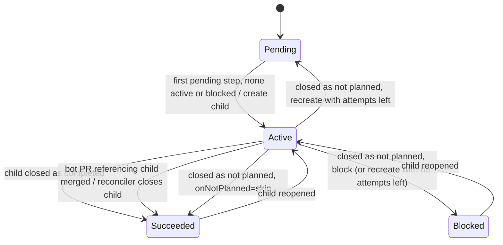
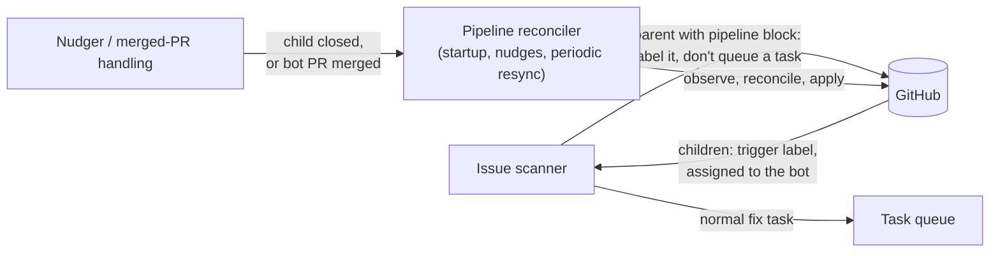

# Design Note: Deterministic Multi-Step Issue Pipelines (`IssuePipeline`)

| Metadata | Details |
| :--- | :--- |
| **Status** | Proposal |
| **Author(s)** | Sam Dowell (`sdowell@google.com`) |
| **Created** | 2026-09-29 |
| **Last Updated** | 2026-10-08 |
| **Replaces** | [`.agents/workflows/kcc-greenfield.txt`](../../.agents/workflows/kcc-greenfield.txt) (LLM-driven `mode: workflow`) |
| **Related** | [workflow-orchestration-and-session-reconciliation.md](workflow-orchestration-and-session-reconciliation.md), [watch-subcontrollers-architecture.md](watch-subcontrollers-architecture.md), [task-recipes-and-outputs.md](task-recipes-and-outputs.md) |
| **Scope** | `factory watch`, `factory` CLI |

---

## 1. Summary

Add a declarative, YAML-defined **`IssuePipeline`**: an ordered list of steps, each a templated GitHub issue. A new deterministic pipeline reconciler in `factory watch`:

1. Opens step N as a **sub-issue** of a parent issue.
2. Waits until that child is **closed as completed**.
3. Opens step N+1.
4. Comments on the parent and closes it after the last step.

Orchestration needs no sandbox, LLM session, journal branch or precondition script. Child issues are ordinary trigger-labelled issues, and they go through the existing fix → PR → PR-watch flow.

Pipelines are defined **only in the repository they run against**, and the latest definition on the default branch is always used.

---

## 2. Problems with the current approach

[kcc-greenfield.txt](../../.agents/workflows/kcc-greenfield.txt) asks an LLM to act as a state machine:

| Concern | Today (LLM workflow) | Cost |
| :--- | :--- | :--- |
| Sequencing | LLM reads a journal and decides "next step?" | Can skip or repeat steps |
| Idempotency | Prompt tells the LLM to search before creating | Duplicate child issues when the LLM forgets or search lags |
| State | Markdown journal pushed to a git branch | Rebase-and-retry loops; state drifts from GitHub |
| Progress UI | LLM hand-writes a table into the parent | Inconsistent format; chatty updates |
| Gating | Precondition script, related-issue list and cooldown | Bash duplicated per workflow |
| Safety | Long "do NOT…" guardrail list | Guardrails only work if the LLM follows them |
| Cost | Sandbox + LLM tokens on every run, including "still waiting" | Wasted compute and tokens |

Latency is no longer the main problem: the Nudger already re-runs a workflow when an issue it waits on closes. What remains is determinism, idempotency and cost. The orchestration needs no judgement. It is a fixed state machine over GitHub issue state, so it should be code.

---

## 3. Goals / Non-Goals

**Goals**
* Declare a multi-step flow as one YAML file in the repository it runs against.
* Deterministic, idempotent, level-triggered reconciliation: the same definition and GitHub state always give the same actions.
* Each step becomes a sub-issue. Step N+1 is created only after step N completes, and only one step is active at a time.
* GitHub is the only state store. Nothing in the daemon has to survive a restart.
* The next child is created within one resync interval of the previous child closing, sooner when a nudge arrives.
* The decision logic is a pure function that can be table-tested.

**Non-Goals (v1)**
* Fan-out (repeating a step once per value of a list), DAGs, parallel steps and conditional steps. The design leaves room for these (§15).
* Pipelines defined outside the watched repository, or pinned to a definition version.
* Replacing LLM-driven workflows that need judgement (for example `kcc-direct-migration-tracker`).
* Changing how child issues are worked on.

---

## 4. Defining a pipeline

### 4.1 Definition file (`.agents/pipelines/<name>.yaml`)

```yaml
apiVersion: factory.gemini.google.com/v1alpha1
kind: IssuePipeline
metadata:
  name: kcc-greenfield
  description: >-
    Drive a KCC greenfield resource to a production-ready direct
    controller at v1alpha1.
spec:
  # Inputs supplied by the parent issue.
  params:
    - name: kind
      description: CamelCase KCC Kind
      pattern: '^[A-Z][A-Za-z0-9]{1,62}$'
      example: SpannerInstanceConfig

  # Applied to every step unless the step overrides it.
  defaults:
    labels: [greenfield]     # the deployment's trigger label is always added
    onNotPlanned: block      # block | skip | recreate
    maxAttempts: 2           # only used by recreate

  steps:
    - id: gen-types
      title: 'Greenfield: Implement direct KRM types, identity, and generate.sh for {{ .Params.kind }}'
      labels: [step/gen-types]
      review: true
      body: |
        Please follow the skill `.gemini/skills/kcc-direct-greenfield-types-implementer/SKILL.md` ...

    - id: controller
      title: 'Greenfield: Implement direct controller, E2E fixtures, and fuzzer for {{ .Params.kind }}'
      labels: [step/controller]
      review: true
      body: |
        ...
        The types were added in #{{ (step "gen-types").Issue }}.

    - id: mockgcp
      title: 'Greenfield: Implement MockGCP and Alignment for {{ .Params.kind }}'
      body: |
        ...

    - id: mockgcp-alignment
      title: 'Greenfield: Align MockGCP logs with RealGCP for {{ .Params.kind }}'
      body: |
        ...

  onComplete:
    closeParent: true
    comment: 'All greenfield steps for `{{ .Params.kind }}` are complete. :tada:'
```

`apiVersion`/`kind` is a versioned schema header, **not** a Kubernetes resource. It lets the format evolve and lets tools recognise a pipeline file.

### 4.2 Schema

| Field | Meaning |
| :--- | :--- |
| `params[]` | Inputs from the parent issue. All are required, and each must have a `pattern` or an `enum`, so free text never reaches a template. Values are strings in v1. |
| `steps[].id` | Unique, stable identity. Children are matched to steps by `id`, never by position or title. |
| `title` / `body` | Templates. They can use `.Params`, a few string helpers, and `step "<id>"`, which gives the issue number and URL of an **earlier** step. |
| `labels` | Added to `defaults.labels`. The deployment's trigger label is always added; definitions never name it. |
| `review` | Opts the child's PR into [automated review](pr-automated-review.md). |
| `assignees` | Optional. Defaults to the watch's target assignee, so the child is picked up quickly. |
| `onNotPlanned` | What to do when a child is closed as not planned or duplicate. `block` (default) waits for a person. `skip` treats the step as done. `recreate` opens a new child, up to `maxAttempts`, then blocks. |
| `completion.closeOnLinkedPRMerge` | Default on. When a bot PR that references the open child merges, the reconciler closes the child as completed (§6.3). |
| `dependsOn` | **Reserved** for DAGs. In v1 each step depends on the previous one. |

### 4.3 Starting a pipeline from a parent issue

The parent issue body contains one fenced block:

````markdown
Onboard SpannerInstanceConfig as a greenfield resource.

```factory-pipeline
pipeline: kcc-greenfield
params:
  kind: SpannerInstanceConfig
```
````

* `pipeline:` is a bare name, resolved to `.agents/pipelines/<name>.yaml` in the watched repository. Paths, URLs and other repositories are rejected, so a pipeline can only create issues in the repository that defines it.
* The parent must be an issue the watch already acts on (trigger-labelled or assigned to a bot), which needs at least triage access.
* Existing issues are bound to steps by an operator (`factory pipeline adopt`, §9), never from the issue body.

### 4.4 Validation

`factory pipeline validate` is suitable for CI. It checks:
* that the schema is strict, with no unknown fields;
* that step ids are unique;
* that every param is constrained;
* that templates parse and only reference earlier steps.

It then renders every step with each param's `example`.

The reconciler runs the same checks against the parent's actual params before it creates anything.

---

## 5. State model: GitHub is the database

The reconciler keeps no state of its own. Each cycle it reads everything it needs from GitHub:

| Artifact | Purpose |
| :--- | :--- |
| **Sub-issue link** (parent → child) | Discovers children and gives native nesting in the GitHub UI. |
| **Hidden marker in each child body** | Names the parent, pipeline and step, plus a hash of the params the child was rendered with. |
| **Status comment on the parent** | Human-readable progress (§8). Output only, never read back as state. |
| **Completion marker on the parent** | Records that the pipeline finished, so completion happens exactly once. |

Child bodies don't mention the parent as `#N`. The sub-issue link already shows the relationship, and leaving the reference out makes it less likely that an agent writes `Fixes #<parent>` (§6.3).

### 5.1 Matching children to steps

A step's children are the issues whose marker names this parent and step. For each step:

* The **canonical child** is the oldest open child, or the newest closed child if none is open.
* Any other open children are duplicates, and they are closed as duplicates of the canonical one.
* The number of children is the step's attempt count, used by `recreate`.

Sub-issues without a valid marker are left alone and listed in the status as unmanaged.

### 5.2 Creating children without duplicates

Creating a child and linking it to the parent are separate operations as far as GitHub guarantees, and the daemon can crash in between. Each cycle, the reconciler therefore also looks at the issues it recently created itself. Any marked issue that isn't yet linked gets linked instead of being created again. This lookup uses the repository's issue listing, not the eventually consistent search index.

### 5.3 Labels and assignees

Without push access, labels and assignees set when an issue is created are silently dropped. The reconciler applies them after creation, checks that they took, and re-applies them every cycle while the child is open. Persistent failures show up in the status comment.

### 5.4 Params can't change after start

Each child records a hash of the params it was rendered with. If someone edits the parent so the params no longer match, the pipeline is **Blocked** until they are restored. To run with different params, file a new parent. This stops a body edit from changing what the remaining steps ask agents to do. Only params are frozen; the definition is still read fresh (§12).

### 5.5 States

Each step follows this state machine:



The pipeline phase is derived from the steps and the parent:

| Phase | Meaning |
| :--- | :--- |
| `Running` | A step is active or about to start. |
| `Blocked` | A step is blocked, or params changed after start. |
| `Paused` | The parent has the stop label. |
| `Succeeded` | Every step succeeded. |
| `Cancelled` | A person closed the parent. |
| `Invalid` | The definition or params failed validation. |

---

## 6. Reconciliation

The design separates **deciding** from **doing**:

* **Reconcile** takes the definition, params and observed GitHub state, and returns a status and a list of actions. It does no I/O and reads no clock, so it is deterministic and table-testable.
* An **executor** applies the actions. Every action is safe to repeat. A failure ends the cycle, and the next cycle observes again and continues.

### 6.1 Algorithm

1. **Parent closed.** If a PR or commit closed it while steps remain, reopen it with a comment. If a person closed it, the phase is `Cancelled`. If the pipeline already completed, do nothing.
2. **Stop label.** The phase is `Paused`; only the status is updated.
3. **Invalid** definition or params. Label the parent and report it in the status; create nothing.
4. **Params changed** after start. The phase is `Blocked`; create nothing.
5. **Repair.** Link marked children that aren't yet linked (§5.2), and close duplicates (§5.1).
6. **Active child.** Re-apply missing labels and assignees. Close the child as completed if a bot PR that references it has merged (§6.3).
7. **Create.** If any step is active or blocked, stop. Otherwise create the child for the first pending step in definition order.
8. **Complete.** When every step has succeeded and the parent isn't marked complete, post the completion comment and close the parent (per `onComplete`). Completion is final; a parent reopened afterwards is left alone.
9. **Status.** Update the status comment if, and only if, its content changed.

There is at most one active step, and at most one create per parent per cycle. A step added to the definition ahead of a started step runs after the active step finishes.

### 6.2 Applying actions

* The executor applies actions in order, and checks that writes such as labels actually took (§5.3).
* The status comment is found by its marker **and** by the reconciler's own identity, so other users' comments are never edited.
* At startup the executor checks its identity and repository permissions, and warns if writes may be limited.

### 6.3 Completion signal and the `Fixes #N` dependency

A step advances when its child closes as completed. Usually the child's PR closes it with `Fixes #N`. That line is written by an LLM, so it can be missing, or it can point at the wrong issue:

* **Missing `Fixes #N`.** When a bot PR that references the open child merges, the reconciler closes the child as completed and names the PR. It hears about the merge through the existing merged-PR handling, and it checks again on resync in case that signal was missed. Only bot-authored PRs count, so an unrelated PR that merely mentions the child can't complete it.
* **`Fixes #<parent>`.** If a PR or commit closes the parent while steps remain, the reconciler reopens it (§6.1).
* **Follow-up outside this design:** check for `Fixes #N` in code instead of relying on the prompt.

---

## 7. Running in `factory watch`

### 7.1 Components

The reconciler is a new subcontroller in the [subcontroller architecture](watch-subcontrollers-architecture.md):



* **Issue scanner.** An issue with a `factory-pipeline` block is routed to the pipeline reconciler and is never queued as a task or treated as a workflow. `factory fix --url` makes the same distinction.
* **Pipeline reconciler.** It reconciles at startup, on nudges and on a periodic resync. Each pass covers open pipeline parents, plus recently closed ones so that accidental closes are caught. It never touches the task queue or sandboxes.
* **Children.** Children are ordinary issues with the trigger label, assigned to the bot, so the existing fast issue scan picks them up.
* **Single writer.** Only one reconciler per repository writes. Others run in plan-only mode. The mechanism (for example, a Kubernetes `Lease`) is an implementation choice, and §17 asks whether more is needed. Pipelines are behind a flag during rollout.
* **Overseer.** If the Overseer runs `factory watch` in time-boxed windows, the startup pass means every window makes progress.

### 7.2 Nudges

When a pipeline child closes, the Nudger triggers the reconciler for the child's parent instead of re-running a workflow. Nudges can be missed, so the periodic resync stays as the backstop.

### 7.3 Identity

The reconciler writes as the watch daemon's GitHub identity. In-cluster that is the bot. A local run writes as whoever runs it, so local use should normally stick to `plan` or use a bot token. If the identity changes, a new status comment is posted.

### 7.4 API cost

Each pass makes a few repository-wide listings, plus one sub-issue read per parent that changed since the last pass, plus any writes. Parents with no changes are skipped, and a periodic full pass guards against stale skips. Nothing is cached across restarts.

---

## 8. Parent status

A single comment on the parent, edited in place, replaces the hand-written progress table:

```markdown
### Pipeline `kcc-greenfield` — SpannerInstanceConfig
**Phase:** Running · **Current step:** 2/4 `controller`

| # | Step | Issue | State | Started | Completed |
|---|------|-------|-------|---------|-----------|
| 1 | gen-types | #10812 | ✅ Succeeded | 2026-09-20 | 2026-09-24 |
| 2 | controller | #10901 | 🔄 Active | 2026-09-24 | |
| 3 | mockgcp | — | ⏳ Pending | | |
| 4 | mockgcp-alignment | — | ⏳ Pending | | |

> ⚠️ #10901 is missing label `factory`: re-adding failed (permission denied)

<sub>definition: .agents/pipelines/kcc-greenfield.yaml@a1b2c3d</sub>
```

* It is rendered purely from the definition and observed state, with no timestamps of its own, so it changes only when something real changes.
* Warnings cover missing labels, closed duplicates, changed params, unmanaged sub-issues and orphaned steps.
* It is a comment rather than the issue body because the reconciler can always edit its own comment, while editing someone else's body can fail.

---

## 9. CLI surface

| Command | Purpose |
| :--- | :--- |
| `factory pipeline validate <file>` | Static checks (§4.4); CI-friendly. |
| `factory pipeline plan --url <parent>` | Show the status and actions a reconcile would produce. Writes nothing. |
| `factory pipeline reconcile --url <parent>` | One-shot reconcile. `factory fix --url <parent>` routes here. |
| `factory pipeline adopt --url <parent> --step <id> --issue <n>` | Bind an existing issue to a step: add the marker and link it as a sub-issue. |

---

## 10. Relationship to recipes and `factory apply`

[task-recipes-and-outputs.md](task-recipes-and-outputs.md) makes `factory apply` the single publisher for **task outputs**, which agents write after reading untrusted text. Pipeline actions are different: no agent produces them, and they come from a trusted definition plus observed GitHub state. The daemon writes them under its own identity, as the scanner does for labels.

v1 therefore doesn't route them through `factory apply`, but it follows the same principles:
* definitions come only from a trusted location;
* params are constrained and validated before rendering;
* writes are idempotent;
* every write can be previewed with `plan`.

If `factory apply` gains verbs for creating sub-issues and closing issues, the executor can reuse them.

Terminology note: a pipeline *step* is a child issue, unrelated to a recipe's steps.

---

## 11. Moving kcc-greenfield to pipelines

Existing kcc-greenfield parents are **not** migrated. New parents use the pipeline, and in-flight ones finish on the old workflow.

1. Commit `.agents/pipelines/kcc-greenfield.yaml` to the KCC repository. Step bodies copy over almost verbatim, with placeholders becoming template params. The review label becomes `review: true`. The precondition script, cooldown, journal, guardrails and "search before create" instructions aren't carried over.
2. File new greenfield parents with a `factory-pipeline` block instead of the workflow reference.
3. Leave in-flight parents on `kcc-greenfield.txt` until they finish. The two don't interfere: a parent is handled as a pipeline only if it has a `factory-pipeline` block.
4. Delete `kcc-greenfield.txt` once no open parent references it.

---

## 12. Edge cases

| Case | Behaviour |
| :--- | :--- |
| Definition edited mid-flight | The latest definition is used. Existing children are never edited. New or changed steps take effect when they come up. Removed steps that have children show as orphaned. |
| Step added ahead of a started step | Runs after the active step finishes. |
| Child reopened | Its step goes back to `Active`. |
| Several open children for one step | The oldest is kept; the others are closed as duplicates. |
| Child closed as duplicate | Handled like not planned. |
| Parent closed by a person | `Cancelled`. Open children are left open. |
| Parent closed by a PR or commit with steps remaining | Reopened with a comment. |
| Parent reopened after completion | Left open; completion isn't repeated. |
| Stop label on the parent | `Paused`. The status still updates. |
| Params changed after start | `Blocked` until restored. |
| Invalid definition or params, or file not found | `Invalid`: the parent is labelled, the status explains why, nothing is created. |
| Transient GitHub errors | That parent is retried next pass. It is not marked `Invalid`. |
| Crash during or after a create | The next pass finds and links the child instead of creating another (§5.2). |
| Second watcher on the same repo | Plan-only (§7.1). |

---

## 13. Alternatives considered

| Alternative | Why not (for v1) |
| :--- | :--- |
| **Create every child upfront**, linked with GitHub's blocked-by dependencies | Freezes future steps at creation, which conflicts with always using the latest definition. The scanner would also have to skip blocked issues. Blocked-by links could still be added later for display. |
| **GitHub Actions** in the target repo | Needs a workflow and a write token in every target repo, which factory doesn't control. Splits the logic and has no dry run. |
| **Kubernetes CRD** for pipelines | The trigger is a GitHub issue, so the CR would only mirror GitHub state, and local runs would depend on a cluster. The schema header keeps this option open. |
| **Keep the LLM workflow** and make only the gating deterministic | Cheaper, but sequencing, idempotency and status would stay LLM-driven. |

---

## 14. Testing, rollout and observability

**Testing**
* Table tests for Reconcile, covering:
  * every state transition;
  * `recreate`;
  * changed params;
  * duplicates;
  * parent closes (by a person vs. by a PR) and reopens;
  * PR-merge completion;
  * a step added ahead of a started step.
* Executor tests against a fake GitHub, including partial failures and dropped labels.
* `validate` run in CI over `.agents/pipelines/`.
* End to end on a scratch repository with a two-step pipeline and real PR merges.

**Rollout**
1. Schema, `validate` and `plan` (read-only).
2. Executor and one-shot `reconcile` (manual progression).
3. Reconciler in `factory watch`, behind a flag.
4. Start one new greenfield Kind on the pipeline, then use it for all new Kinds and enable the flag by default. Delete `kcc-greenfield.txt` once in-flight parents finish.

**Observability**
* A journal entry for every action taken.
* Pipeline phase and step states exposed on the watch's local API.
* Dry-run mode that logs actions instead of writing them.
* Warnings for persistent write failures and for not being the single writer.

---

## 15. Future extensions

* **Fan-out.** Repeat a step once per value of a list param, with one sub-issue per value and a cap on how many are open at once. v1 leaves room for this:
  * steps are identified by `id`, not position;
  * the child marker can carry an extra per-value key;
  * params can gain a list type;
  * the status comment can nest per-value rows under a step.
* **`dependsOn`**: steps form a DAG.
* **Gate steps**: wait on a label or approval without creating an issue.
* **Conditions** on params.
* **Require a merged PR** for completion, if closed-as-completed proves too loose.
* **Blocked-by links** between children, for display.

---

## 16. Decisions

| Question | Decision |
| :--- | :--- |
| Pin the definition version? | **No.** Always use the latest definition on the default branch. |
| Where can definitions live? | **Only in the watched repository**, under `.agents/pipelines/`. |
| Params source | An explicit `factory-pipeline` block in the parent. Params are frozen after start. |
| Completion signal | The child is closed as completed. As a backstop, a merged bot PR that references the child also completes it. |
| Fan-out in v1? | **No.** Deferred; the design leaves room for it (§15). |
