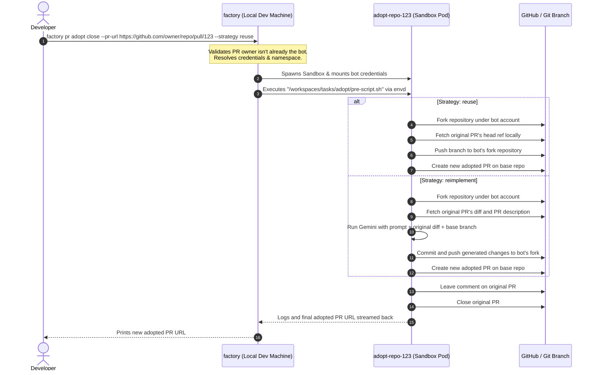

# Design Note: PR Adoption Workflows (Git-based & LLM-based)

This design note outlines the architecture and execution flow for adopting third-party Pull Requests under the onboarded factory-user identity.

---

## Background & Problem Statement

When the `factory` is used in a collaborative repository, it needs to watch, iterate, or investigate PRs authored by external developers. However:
1. Standard user tokens/credentials do not have push access to external user forks.
2. If we try to push changes to the original author's fork branch, GitHub will reject the push with `permission denied`.
3. To work around this, we must "adopt" the PR first by forking the base repository under the factory-user's account, creating a new branch, pushing the commits there, creating a new PR from the bot's fork, and commenting/closing the original PR.
4. Performing git operations directly on the developer's local machine tries to use the developer's credentials rather than the bot credentials (which only reside in the Kubernetes namespace secret), resulting in permission failures.

Therefore, the adoption process **must execute entirely inside the sandbox environment** where the correct bot credentials are mounted and configured automatically.

---

## Proposed Architecture: Sandbox-Bound PR Adoption

We implement a dedicated `factory pr adopt` command that handles sandbox scheduling and runs the adoption logic inside it.

We support two adoption strategies:
1. **`reuse`**: A git-based approach that fetches the original PR history and pushes it directly to the factory-user's fork to preserve history and git authorship.
2. **`reimplement`**: An LLM-based approach that pulls the latest main/master branch, downloads the original PR diff, and instructs the LLM (Gemini) to use the diff as inspiration/guidelines to re-implement the fix/feature from scratch on top of the latest base.

---

## Execution Flow



---

## CLI Command Interface

### `factory pr adopt`
```bash
factory pr adopt <open|close> --pr-url <url> [flags]
```

#### Positional Arguments
* `<open|close>` (Required): Specifies the post-adoption state action for the original PR.
  * `open`: Comments on the original PR linking to the new one, but leaves the original open.
  * `close`: Comments on the original PR, links to the new one, and closes the original PR.

#### Flags
* `--pr-url <string>` (Required): The URL of the incoming PR to adopt (e.g. `https://github.com/owner/repo/pull/123`).
* `--strategy <reuse|reimplement>` (String, default: `reuse`):
  * `reuse`: Direct git fetch/push (preserves commit history).
  * `reimplement`: Re-apply changes using LLM on the latest base branch.
* Standard Sandbox configuration flags (e.g., `--namespace`, `--secret-name`, `--workspace-disk-size`, `--image`, `--ephemeral-storage`).

### Reverting `--adopt` flag on other subcommands
The `--adopt` flag will be removed from `factory pr watch`, `factory pr iterate`, and `factory pr investigate`. These commands will verify ownership of the PR and error out immediately if it does not belong to the factory user:
```
PR was not created by the factory user (bot). It is owned by <author>. Use 'factory pr adopt <open|close> --pr-url <url>' to adopt it first.
```

---

## Task Implementation Inside the Sandbox

We introduce a new task type `adopt` inside `factory/pkg/tasks/`:

### 1. `adopt.sh` (Shell script executed inside sandbox)
Executes the git and GitHub API steps.
* Uses the mounted `GITHUB_TOKEN` secret to configure `git credential.helper` and authenticate `gh`.
* Performs `gh repo fork --remote` to ensure the fork exists under the bot account.
* If `reuse`:
  * Fetches the original PR head from upstream.
  * Pushes the branch to `origin` (the bot's fork).
  * Creates the new PR using `gh pr create`.
* If `reimplement`:
  * Fetches original PR diff (`gh pr diff`).
  * Runs the `gemini` command passing the prompt template.
  * Commits and pushes the modified code to the fork.
  * Creates the new PR.
* Comments on and optionally closes the original PR.
* Outputs the new PR URL to `agent-output.txt`.

### 2. `adopt.txt` (LLM prompt template for reimplement strategy)
```
You are the PR Adoption agent. We want to adopt a third-party PR under our factory user identity.
To do this, you should re-apply the changes from the original PR as inspiration, but implement them on top of the latest base branch.

Original PR Title: {{ .Title }}
Original PR Description:
{{ .Body }}

Original PR Diff:
{{ .Diff }}

Please implement the same fix/feature on the current repository, ensuring all tests pass and following the repository's guidelines.
```
