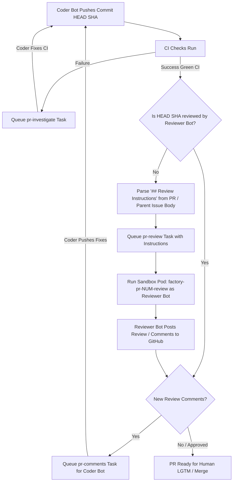

# Automated Pull Request Review Architecture & Design

This document describes the design, lifecycle, and identity model for automated AI Pull Request code reviews within the `factory watch` orchestration daemon.

---

## 1. Overview & Motivation

Pull Requests created by automated workflows (such as migration checklists in `.agents/workflows/kcc-example.txt`) or standalone issue-fix agents require rigorous, independent code review before human approval or merging.

Rather than coupling review lifecycle loops into individual workflow scripts, the AI Factory uses a **Watch-Driven Automated Review** model combined with **Markdown-Bounded Contextual Hints**:
- **Opt-In Triggering (`overseer/review`)**: To prevent reviewing too many PRs unnecessarily, automated AI review is gated on the presence of the `overseer/review` label (or `<triggerLabel>/review`) on the PR itself. A new PR inherits the label from its referenced parent Issue the first time the watcher sees it, so labelling the Issue is still all a repository has to do. Once opted in, the PR automatically receives a code review when CI passes on the current HEAD SHA.
- **Human Takeover (Non-Sticky Label)**: The inheritance is a one-time handoff, not a continuous sync. Removing `overseer/review` from a PR opts that PR out for good: the watcher reads the PR's own label history (`unlabeled` events) and will not re-apply a review label it has previously had taken off, even across restarts. This lets a reviewer take over a single PR without opting the parent Issue — and every sibling PR — out of automated review. This is a general mechanism (`nonStickyLabels`) for labels whose *absence* on a PR is itself an instruction; the review opt-in is its only member today, and all other inherited labels remain sticky.
- **Context-Aware Criteria (`## Review Instructions`)**: Workflows and PR authors can provide domain-specific review rules (such as `generate.sh` verification or round-trip fuzzer checklists) directly inside the PR description or its referenced parent Issue body.
- **Identity Isolation**: Reviews are executed in a dedicated Kubernetes Sandbox Pod under a distinct **Reviewer Bot** identity (`reviewbot-robot`), maintaining separation of duties from the Coder Bot (`lovelace-coder-bot`, etc.).

---

## 2. End-to-End Lifecycle Flow



---

## 3. Review Instructions Specification (`## Review Instructions`)

### A. Why Issue/PR Body Sections Over Labels
- **Universal Compatibility**: Many repositories restrict arbitrary labels or limit label creation permissions. Issue/PR Markdown descriptions work across all repositories.
- **Multi-Line & Structured**: Supports bulleted lists of files or raw text instructions without the 50-character limit of GitHub labels.
- **Inheritance**: If a PR references a parent Issue (`Fixes #123`, `Closes #123`), review instructions defined in the parent Issue are automatically inherited.

### B. Section Syntax & Parsing Rules
The helper `ExtractReviewInstructions` (`factory/pkg/commands/review_instructions.go`) parses Markdown content following these rules:

```markdown
## Review Instructions
- `.gemini/skills/generate-sh-checker/SKILL.md`
- Ensure all exported functions have GoDoc comments.
- `.gemini/skills/kcc-direct-controller-implementer/SKILL.md`

### Sub-notes for Reviewer
Pay special attention to field conversion accuracy.

## Next Section
```

1. **Header Discovery**: Matches any line starting with `#` through `######` followed by `Review Instructions` (case-insensitive). Records heading level $L$ (number of `#` characters).
2. **Multi-Line Span**: Reads all subsequent lines until it encounters any heading of equal or higher level (`#` up to $L$ `#`s). Sub-headings deeper than $L$ are retained inside the section.
3. **Path & Bullet Cleanup**: Strips Markdown list prefixes (`- `, `* `, `1. `) and enclosing backticks around paths (e.g. `` `.gemini/skills/foo/SKILL.md` `` $\rightarrow$ `.gemini/skills/foo/SKILL.md`).
4. **Resolution**:
   - If an instruction matches a file path in the repository, `factory pr review` loads the file contents at `headSHA`.
   - If an instruction is plain text, it is treated as direct prompt instructions.

---

## 4. Execution Sandbox & Reviewer Identity

### A. Role Resolution (`selectUserForTask`)
When `watch.go` dequeues a `pr-review` task, it routes execution through `selectUserForTask` (`factory/pkg/commands/watch.go:L2755`):
```go
case taskType == "pr-review":
    role = "reviewer"
```

### B. Configured Reviewer User (`FactoryConfig.Roles["reviewer"].Users`)
In the repository configuration (`overseer/examples/kcc.yaml`):
```yaml
roles:
  reviewer:
    users:
      - reviewbot-robot
  coder:
    users:
      - lovelace-coder-bot
      - hopper-coder-bot
      - ada-coder-bot
```
- `selectUserForTask` selects **`reviewbot-robot`** (or the repository's configured `reviewer` user pool).

### C. Pod Execution & API Identity
- `factory pr review` runs inside a dedicated Kubernetes Pod (`factory-pr-<num>-review`) in the configured namespace.
- It mounts the onboarded Kubernetes secret for `reviewbot-robot`, containing that account's `GITHUB_TOKEN`.
- All inline review comments, approvals (`APPROVED`), and change requests (`CHANGES_REQUESTED`) posted to GitHub are authored by **`reviewbot-robot`**.

---

## 5. Ready-for-Human Signaling (`overseer/ready-for-human`)

Once a PR successfully passes automated code review by the reviewer bot, the factory watcher automatically applies the `overseer/ready-for-human` label (or `<triggerLabel>/ready-for-human`).

### A. Ready Conditions
The label is applied when all of the following conditions are met:
1. **Review Completed on HEAD (if enabled)**: If the PR carries `overseer/review` (inherited from its parent issue when the PR was first seen), a configured reviewer bot must have completed its review on the latest `headSHA`. If the label is absent — never inherited, or removed by a human taking over the review — this prerequisite is automatically satisfied.
2. **Review Passed**: The latest review from the reviewer bot is not `CHANGES_REQUESTED` and all review feedback has been resolved (`!hasNewComments`).
3. **Passing CI Checks**: All GitHub check runs and commit statuses for `headSHA` are green (`!hasFailure`).
4. **Mergeable**: No merge conflicts or pending rebases (`!isConflicting`).
5. **Active & Open**: PR is open, not in draft mode, and not stopped (`!hasStopLabel`).

### B. Invalidation & Removal
The label is automatically removed if any condition ceases to hold (e.g. new commits pushed, new comments added, CI check failures, or merge conflicts), ensuring humans only review PRs that currently pass all automated criteria.

### C. Reviewer & Author Best Practices
Human reviewers and authors should wait for the `ready-for-human` label (or `<triggerLabel>/ready-for-human`) to be applied to a pull request before leaving review comments. If comments are added while the system is actively investigating CI check failures or resolving merge conflicts, subsequent automated commits pushed by the bot might render those comments outdated or cause them to be ignored. Waiting for the `ready-for-human` label ensures that the bot has finished all its automated cycles and is ready for human collaboration.

