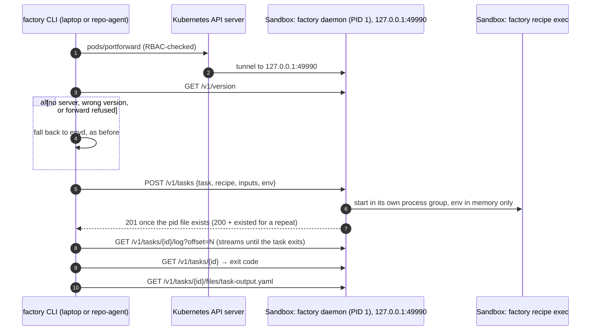

# Design Note: A Task Server for Recipe Tasks

**Status:**
- **Phase 1 built:** the task server in `factory daemon`, the client over a port-forward, and recipe commands moved to it with envd as the fallback.
- **Phase 4 in part:** the daemon serves acpd's sessions under `/v1/sessions`, including sessions that belong to a task, and recipe asks go through them.
- **Phase 4 clients built:** repo-agent's research and "Continue session" on plan and triage use those sessions over the port-forward.
- **Proposals:** the other phases.

Recipe tasks (plan, triage) already run independently of whoever starts them. The daemon claims them from the spool and runs them in their own task directories (see [task-recipes-and-outputs.md](task-recipes-and-outputs.md)). But every client still talks to them through **envd**:

- the spool is written file by file with `exec`;
- the task list is a shell script run through `exec`;
- attach polls with three execs every two seconds;
- abort is a `kill` script.

This note replaces envd for recipe tasks with a small REST server in the daemon.

---

## Background & Problem Statement

1. **envd is unauthenticated and reachable across namespaces.** The cluster has no NetworkPolicies. Anyone who can reach a sandbox's `-lb` Service can run commands in it.
2. **Every operation is a shell script.** Listing, reading a file, tailing a log and killing a task are each built as `sh -c` strings. Their output is parsed back, and each costs an exec round trip.
3. **Attach is polling.** It runs exit-code, pid and log-tail execs every 2s. Output arrives late, and one attach costs ~1.5 execs a second for as long as the task runs.
4. **Abort kills only the direct children.** The agent's own children (tools, shells) can outlive an abort.
5. **The task's environment goes to disk.** A spooled task's `env.json` holds its credentials until the daemon claims and deletes it.

---

## Architecture

### The endpoint

The server uses REST and JSON on `net/http`, with no code generation. This is the same choice acpd made (REST + NDJSON).

| Method and path | What it does |
|---|---|
| `GET /v1/version` | `{"api":1}`. A client that needs more falls back to envd. |
| `GET /v1/tasks` | Every task, newest first, using the same entries as `factory sandbox task list`. |
| `POST /v1/tasks` | Starts a recipe task. Idempotent by id and by run name. |
| `GET /v1/tasks/{id}` | One task. |
| `GET /v1/tasks/{id}/log?offset=N&follow=true` | The log from byte N. When following, the response ends when the task exits. |
| `GET /v1/tasks/{id}/files` | The task directory's files, never `env.json`. |
| `GET /v1/tasks/{id}/files/{name}` | One file. `env.json` returns 403. |
| `PUT /v1/tasks/{id}/files/{name}` | Only the applied marker (`taskoutput.AppliedFile`) may be written. |
| `POST /v1/tasks/{id}/cancel` `{"kill":bool}` | Ends the task's **process group**: SIGTERM with exit 143, or SIGKILL with exit 137 (a quota kill). Also closes the task's agent session. |
| `/v1/sessions[/...]` | acpd's session API (create, prompt, events, permission, mode, cancel, delete), served by the daemon. `GET /v1/version` reports `"sessions":1` when it is there. |

### Agent sessions

The daemon holds one acpd session registry.

- **Who reaches it:** the task server mounts it under `/v1/sessions`. Research sandboxes (`ACPD_ENABLE`) also keep it on the pod IP's `:49984`, the same registry, until clients move to the port-forward.
- **Sessions that belong to a task:** a create with `"task":"<id>"`:
  - is named after the task;
  - keeps its transcript and session record in `<taskDir>/session`.
- **While the task runs, only the task may drive the session:**
  - The daemon mints a token per task at launch and passes it in the task's environment as `FACTORY_TASK_TOKEN`. It is kept in memory and never written to disk.
  - Creating the session, prompting, answering a permission, switching mode, cancelling and deleting need the token in `X-Factory-Task-Token`.
  - Everyone else can read the session and follow its events. A refused call answers 409.
- **Once the task has ended,** the session is anybody's. Creating it again loads the recorded conversation (`session/load`), so a member can continue a plan or triage where the task left off.
- **Cancelling the task** closes its session.
- **Recipes use it.** A recipe task with `FACTORY_TASK_TOKEN` in its environment creates its session on the daemon (`yolo`, auto-approve) and asks through `/v1/sessions/<task>/prompt` and `/events`. Without the token (a task envd started, or an older daemon), it runs the engine in its own process as before. `run:` steps do not get the token.

**Rules the server follows:**

- **It builds the command itself.** It builds it from the recipe and inputs, as the spool does. It never runs a command it is given.
- **Names are one path element.** Ids and file names must match `^[A-Za-z0-9_][A-Za-z0-9._-]*$`, so no request reaches outside the tasks directory.
- **POST answers once the task has started,** so the client can follow the log at once.
- **POST is serialized.** A mutex makes "find by id or run name, then start" one step, so the same task posted twice starts only once. This holds for a retry that lost its answer, and for repo-agent reusing a run name.
- **A process that is gone without an exit code gets 137.** If a followed log finds the task's process has been gone for 5s with no exit code, the server records 137, as the envd attach does.
- **Task directories are unchanged.** A task the server started and one envd started look the same, and either transport can read both. During the transition, `factory sandbox task list` sees every task whichever way it was started.

### Transport: a port-forward to loopback

- **Where it listens:** the server binds `127.0.0.1:49990` only. It has no Service and is not reachable on the pod IP.
- **How factory reaches it:** through a client-go port-forward. It tries websockets first and falls back to SPDY (`portforward.NewFallbackDialer`), as kubectl does, so no kubectl binary is needed.
- **Who may call it:** the API server authenticates the caller and checks RBAC `pods/portforward` on the sandbox's pod. That is the authorization: the same principal that may exec in the pod today.
- **When the forward drops:** it ends when the pod goes. The client then finds the pod again (waking the sandbox, as envd's connect does) and opens a new forward. Every call is safe to repeat.
- **Attach is one long request.** The client keeps the byte offset, so a stream that breaks resumes where it stopped. The quota watch (`envd.QuotaWatch`) reads the same chunks as before. A fatal quota error cancels the task with `kill`.

### Fallback and version skew

`taskapi.Connect` falls back to envd in these cases:

- the port-forward fails (the caller lacks `pods/portforward`, or the pod is gone);
- nothing answers on the port (a sandbox on an image older than the server);
- the server's API version is lower than the client needs;
- `FACTORY_TASK_TRANSPORT=envd` is set.

Either way, factory prints which transport it uses. The envd path is unchanged, including `RunTaskResilient` for images that have no daemon at all.

Existing sandboxes keep their image until they are recreated (see the recipe-skew note in the sandbox launcher work). So both transports will be in use for a while, and envd stays until every sandbox runs a server.

### Caller changes

- **`factory recipe plan|triage`** and **`factory sandbox task list|status|output|attach|logs`** go through a `taskapi.Sandbox`, with two implementations: `ServerSandbox` and `EnvdSandbox`.
- **repo-agent** needs no code change, because it shells out to those commands. Its controller role gains `pods/portforward` (`create`). Without it, the commands fall back to envd.

### Known limits

- **Same-pod processes can call the server.** The agent in the sandbox can reach `127.0.0.1:49990`. It already shares the pod with the daemon, its files and its processes, so the server gives it nothing new. A token or a Unix socket could close this later.
- **Classic tasks are unchanged** (fix, explore, review…). They still run through envd's resilient path.
- **acpd** still listens on the pod IP on `:49984`, unauthenticated.

---

## Phases

0. **Shared pieces** (done): `envd.QuotaWatch`, `spool.ListScript`/`ParseList`/`Fail` exported, and the usage harvest reading through any file reader.
1. **Recipe tasks** (built): the server in the daemon, the client over a port-forward, recipe commands and `sandbox task` moved to it, envd fallback, and the RBAC marker in repo-agent.
2. **Verify in cluster:** a factory image with the server, recreated sandboxes, and repo-agent's RBAC applied. Then confirm that plan and triage from the board run over the forward.
3. **Classic tasks:** start them through the server too, with attach as a stream. Then the polling attach and the `kill` scripts go.
4. **acpd behind the same surface:**
   - **Done:** sessions under `/v1/sessions` on the loopback server, task-owned sessions, `session/load`, and recipes driving their asks through it.
   - **Done:** repo-agent reaches sessions over the port-forward: research first, then "Continue session" on plan and triage, which opens the task's session in the research view (`/api/task-sessions/<sandbox>/<task>`), a watch while the task runs. A sandbox on an older image falls back to the terminal.
   - **Last:** drop the `:49984` listener.
5. **Retire envd for factory:** once no supported image lacks the server, remove the fallback and the envd Service from sandboxes.
