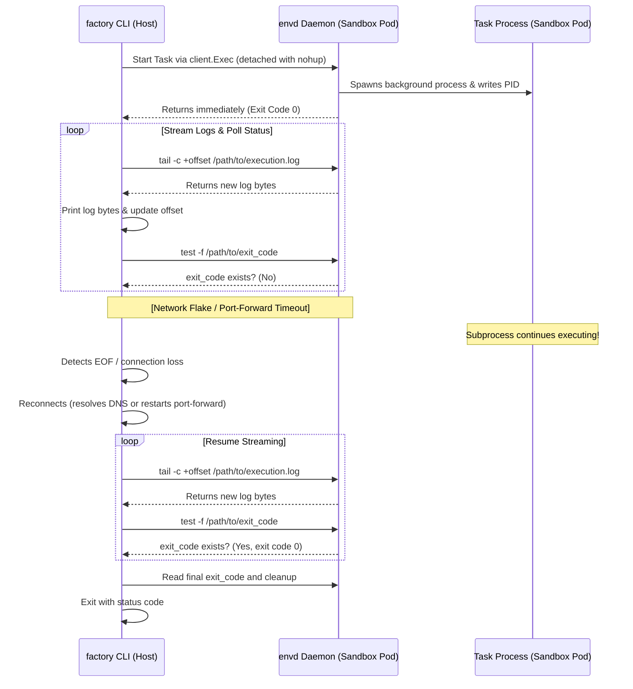

# Design Note: Resilient & Reconnectable Task Execution

This design note outlines the plan for implementing a resilient task execution wrapper in `factory` to protect execution inside sandbox pods against network dropouts, `kubectl port-forward` timeouts, and local connection flakes, while preserving interactive terminal control.

## Background & Problem Statement
Currently, `factory` runs commands inside sandbox pods using synchronous Connect-RPC streams. If the connection drops (e.g. idle timeout, VPN flake), the RPC context is cancelled, which immediately kills the running process in the pod, aborting the task and leaving the sandbox in an incomplete/dirty state.

## Proposed Architecture: Detached Run & Log Polling

Rather than modifying the underlying `envd` server binary, we wrap execution logic inside the `factory` CLI client utilizing standard POSIX commands (`nohup`, `tail`, `cat`) present in the sandbox container.



---

## Technical Details

### 1. Detached Launch Command
Instead of executing the bash command directly, the client executes a wrapper command that detaches the process:
```bash
nohup sh -c "echo \$\$ > {taskDir}/pid; {cmdStr} > {taskDir}/execution.log 2>&1; echo \$? > {taskDir}/exit_code" >/dev/null 2>&1 &
```
This command:
1. Records the background PID to `{taskDir}/pid`.
2. Runs the script `{cmdStr}`, piping all output to `execution.log`.
3. Writes the status exit code to `exit_code` file upon completion.
4. Exits immediately, allowing the Connect-RPC request to finish with code `0`.

### 2. Client Tailing Loop (Interactive Mode)
In interactive (default) mode, the client performs the following loop:
1. Calls `client.Exec` to run `tail -c +<offset> {taskDir}/execution.log` (initially `offset = 0`).
2. Appends any received bytes to local stdout/stderr, and increases the `offset` by the number of bytes read.
3. Checks if `{taskDir}/exit_code` exists.
   - If yes: reads the exit code, performs **one last `tail` check** to fetch any final lines written between checks, and exits the loop.
4. If a connection error occurs during this loop:
   - CLI catches the connection loss.
   - Retries connection (resets `kubectl port-forward` or direct DNS endpoint).
   - Resumes the tailing loop from the last recorded `offset`.

### 3. Concurrency & Execution Modes

* **Interactive Mode (Default)**: Developer runs `factory fix`. It tails logs and supports **Ctrl+C abort**.
  - **Ctrl+C Handling**: If the developer presses Ctrl+C, the local CLI process catches the interrupt signal and sends a termination command to the pod before exiting:
    ```bash
    kill $(cat {taskDir}/pid)
    ```
* **Detached Mode (`--detached` flag)**: Developer (or automation like `factory watch`) runs `factory fix --detached`.
  - The CLI launches the task in the background and returns immediately, outputting: `"Task fix-xxx started in background."`

---

## Pitfalls & Mitigations

| Pitfall | Impact | Mitigation |
| :--- | :--- | :--- |
| **Tmux Compatibility** | Tmux can fail in containers with restricted PTY or socket permissions. | Used `nohup` (standard POSIX fork) which has zero socket/PTY dependencies. |
| **Log Polling Overhead** | Downloading the entire log file recursively wastes CPU/bandwidth. | Used `tail -c +<offset>` to retrieve only the delta bytes since the last read. |
| **Log Truncation** | The process might exit, but the client breaks the loop before reading final log lines. | Perform one final `tail -c +<offset>` check after detecting the `exit_code` file. |
| **Orphaned Processes** | Forgotten tasks run forever. | Deleting the sandbox pod via standard controller methods cleans up all resources. |
