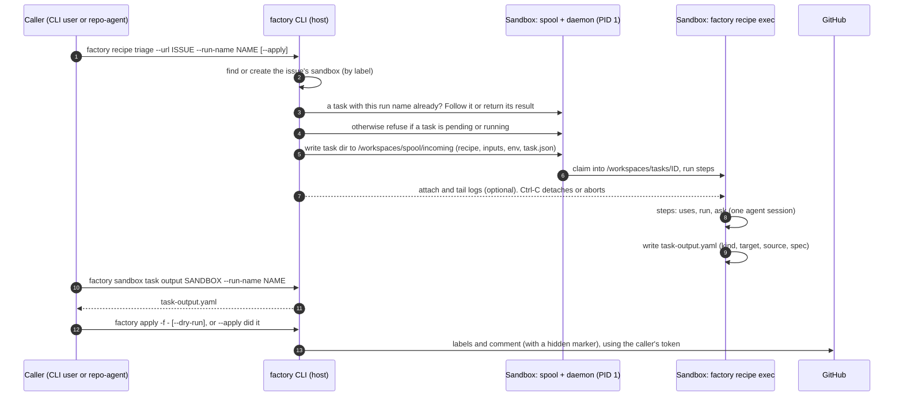

# Design Note: Recipes, Task Outputs and Apply

**Status:** Proposal. Triage is built this way end to end (#1707–#1723). Other task kinds are not yet built.

This note describes how a factory task should run and how its result should reach GitHub. A **recipe** describes the work. A **spooled task** runs it inside the sandbox, independent of whoever started it. The task leaves a **task output**, a typed document of what it found. **`factory apply`** is the one place that turns that document into GitHub writes, using the caller's identity.

---

## Background & Problem Statement

`factory triage` was typical of the per-verb tasks:

1. **Policy lived in a script per verb.** `triage_issue.sh` plus a rendered prompt were uploaded on every run. Changing the order of steps meant changing shell code, and every verb carried its own copy of the agent loop.
2. **The result was stdout.** The triage was printed between `ISSUE TRIAGE` banners. Callers such as repo-agent scraped it, so the banner format was a wire contract.
3. **The result belonged to the caller's process.** If the CLI died, the result was only in a file that one script knew the name of. repo-agent had to adopt orphaned runs by guessing at the "newest task directory with this prefix".
4. **The task could publish.** `--publish yes` applied labels and comments from inside the run. That made publishing hard to separate from producing, and hard to repeat safely.
5. **Each verb had its own sandbox.** Triage used `triage-<repo>-<N>`, separate from plan and fix in `fix-<repo>-<N>`, which split one issue's work and state across two sandboxes.

---

## Proposed Architecture



The pattern has four parts and one addressing rule.

### 1. Recipe: what runs

A recipe is YAML shaped like a GitHub Actions workflow and embedded in the factory binary. Built-in recipes are commands, for example `factory recipe triage`.

| Field | Meaning |
|---|---|
| `inputs:` | Named inputs with defaults and `required`. `type: instructions` takes repeatable `--instruction` values (a file, a repo path, or text). |
| `context:` | Rules sent to the agent once, at the start of the session. |
| `steps:` | `uses:` runs a named `lib.sh` step from a closed set. These are the only steps that get the token. `run:` is inline shell without the token, with inputs as `INPUT_*`. `ask:` is one prompt turn; all asks share one agent session. `capture:` saves a turn's reply to a file. |
| `outputs:` | Files the task's result consists of. |
| `task-output:` | `{kind, from}`: the file that becomes the typed result, and its kind. |

The sandbox runs the recipe with its own `factory recipe exec`. The CLI strips the fields it handles itself, such as `task-output:`, before uploading (`recipe.ForSandbox`).

### 2. Spooled task: where and how it runs

- **Submission.** The client writes a task directory into `/workspaces/spool/incoming/`. The sandbox's daemon (PID 1) claims it, moves it to `/workspaces/tasks/<id>`, and runs it as its own child. The task does not depend on the client's connection or process.
- **Identity.** Task IDs are `recipe-<name>-<YYYYMMDD-HHMMSS>-<hex>`, so they sort by time. `task.json` records the ID, `run_name`, recipe, target URL, submission time and the output declaration.
- **Lifecycle.** A task is Pending, then Claimed, then Running, then Exited with an exit code. A dead PID reads as exited 137.
- **Tools.** `factory sandbox task list | attach | logs | status | output <sandbox | issue/PR URL>` work with any task. You can pick a task with `--task <id>` or `--run-name <id>`; the newest match wins.

### 3. Task output: the typed result

```yaml
apiVersion: factory.gemini.google.com/v1alpha1
kind: Triage
target:
  url: https://github.com/owner/repo/issues/123
source:
  sandbox: fix-repo-123
  task: recipe-triage-20261003-085545-13f9
  recipe: triage
  engine: gemini
spec:
  labels: [repo-agent, enhancement]
  priority: medium
  duplicates: []
  assessment: "…"
```

The runner wraps the declared file (`from:`) into this document as `task-output.yaml` in the task directory. For sandboxes whose runner predates task outputs, `sandbox task output` does the wrapping on the client side. The document is a draft: a person or program can read it, edit it, and keep it. Nothing has happened on GitHub at this point.

### 4. Apply: the one publisher

`factory apply -f <file|->` parses the document according to its kind and performs that kind's writes using the **caller's** token. Tasks never write to GitHub; the one exception is git push and PR creation inside the sandbox, as before.

- **Dry run.** `--dry-run` prints what it would write and writes nothing.
- **Idempotent.**
  - A comment carries a hidden marker, `<!-- factory:task-output kind=… task=… -->`, and apply skips posting if a comment with that marker already exists.
  - Adding labels is idempotent anyway.
- **Kind-aware.** Each kind decides which targets it accepts; for example, a Triage refuses a PR URL.

### Addressing: one sandbox per issue

An issue's triage, plan, fix and recipes all run in one sandbox.

- **Finding it.** factory labels the sandbox `factory.gemini.google.com/repo` and `/issue`, and callers find it by those labels rather than by name.
- **State.** A side task records its state in `sandbox.gemini.google.com/<type>-task-state`, for example `recipe-triage-task-state`. It never touches `last-task-*`, which stays the plan's or fix's.
- **One at a time.** A sandbox with a pending or running task refuses another, because two agents in one checkout would get in each other's way.

---

## How callers run it

| Mode | Command | Ctrl-C / caller dies | Rerun |
|---|---|---|---|
| Foreground | `factory recipe triage --url U` | Aborts the task (`--abort-on-cancel`, the default) | New task; with `--run-name`, the same task |
| Detached | `… --detached`, later `sandbox task status`, then `output` | Nothing to interrupt | Read by `--run-name`, or rerun with it |
| Wait and apply | `… --apply [--dry-run]` | Stops waiting; the task keeps running | Picks up the newest run of this recipe and URL: waits if it's running, applies if it exited 0 and isn't yet applied (`task-output.applied`) |
| Program (repo-agent) | `… --run-name NAME --abort-on-cancel=false`, then `sandbox task output --run-name NAME` | The task survives; the prober adopts its `task-output.yaml` | Same run name finds the same task |

**Run names** are chosen by the caller and opaque to factory. They contain identifiers only, because anyone in the sandbox can read them. They are recorded in the task's `task.json` (`run_name`). The task directory keeps its generated, time-sorted name, because a run name may contain `/`.

**A run name is one run's, so launching with one is idempotent.** `factory recipe … --run-name NAME` looks for a task recorded under NAME before starting anything:

| Task under NAME | Without `--apply` | With `--apply` |
|---|---|---|
| None | Start one | Start one, wait, apply |
| Pending or running | Follow it (`--detached`: print how to) | Wait for it, apply |
| Exited 0 | Print its outputs | Apply, unless already applied |
| Failed | Error: retry under a new name | Error: retry under a new name |
| Another recipe or URL | Error: the name is taken | Error: the name is taken |

A run name takes precedence over `--apply`'s "newest run of this recipe and URL" rule. repo-agent uses `request/<Request UID>` for a click (one task per click) and `auto/<board>/<issue>/<launch time>` for auto-triage, one per attempt, so a failed run is retried rather than returned.

---

## Worked example: triage

| Step | PRs | What changed |
|---|---|---|
| Recipe model | #1707–#1710 | `triage.yaml` replaces `triage_issue.sh` with steps. `recipe run`, `outputs:`, and the default branch checked out from upstream. |
| Spool and task tools | #1714–#1716 | The daemon claims spooled tasks. `sandbox task list/attach/logs/status/output`. |
| Task output and apply | #1717, #1718 | `task-output.yaml` (kind Triage), `factory apply`, and `factory recipe triage`. |
| One sandbox per issue | #1719 | Triage runs in the issue's sandbox, found by label, with its own `<type>-task-state`. Repeatable `--instruction`. |
| Wait, apply, resume | #1720 | `recipe … --apply`, which picks up after an interruption. |
| repo-agent | #1721 | Runs `recipe triage --run-name` and reads the result by run name instead of from stdout banners. |
| Idempotent launch | this change | A rerun with the same run name follows or returns that task instead of starting another. |
| Removal | #1722, #1723 | `factory triage`, its script and prompt, and repo-agent's support for old `triage-*` sandboxes and old annotations are gone. |

---

## Adding a new kind

1. **Write the recipe.** Its steps must produce one file, declared as `task-output: {kind: X, from: x-output.yaml}`. Tell the agent in `context:` not to write to GitHub.
2. **Add the kind to `pkg/taskoutput`.**
   - A parser for the agent's raw output.
   - A typed spec.
   - `apply` logic. Make it idempotent with a marker, or with a natural key such as the commit SHA.
3. **Pin the target to what the task saw.** For example, add `target.commit` for a Review, so that applying a stale review to newer code is refused or flagged.
4. **Update callers.** Start the task with a run name and read the output by that name. Leave publishing to `apply`, and never publish from inside the task.

Planned kinds, in order:
- **Review.** Pin `target.commit`; submit as a pending review or a comment.
- **PullRequest.** Link and alias an existing PR, and add labels.
- **Plan.** A draft that can be fed into the next task's inputs, for example `fix` using an approved plan.

After those, repo-agent's drafts become the documents themselves, published through the same applier.

---

## Pitfalls & Mitigations

| Pitfall | Mitigation |
|---|---|
| **Image skew.** A reused sandbox keeps the image it was created with. An image without `factory recipe exec`, or with an older recipe schema, fails the task. | Decided: recreate the sandbox. There is no fallback to old task scripts, and recipes are not stripped down for old runners. The spool falls back to envd only for sandboxes whose daemon doesn't claim tasks. |
| **The applied marker is best-effort.** `task-output.applied` is written after apply. If writing it fails, a rerun applies again. | Apply is idempotent through the comment marker and label semantics, so applying twice is harmless. |
| **Agent output is untrusted.** | Apply acts only on the parsed fields of a known kind, against the document's `target`, using the caller's token. A dry run shows exactly what would be written. |
| **Two tasks in one sandbox.** | The busy check refuses to start a second one. Side-task state annotations keep each task's status separate. |
| **"Newest" is ambiguous** when several runs exist. | Programs use `--run-name`. "Newest run of this recipe and URL" is only the human `--apply` resume rule. |

---

## Non-goals

- **No change to overseer or `factory watch`.** They keep the classic task model, and none of this is required for them.
- **No caller-chosen task IDs.** Task IDs stay generated and timestamped; the run name is the caller's handle, and it makes launching idempotent.
- **No GitHub writes from tasks.** Git push and PR creation by fix-type tasks remain the only exception.
