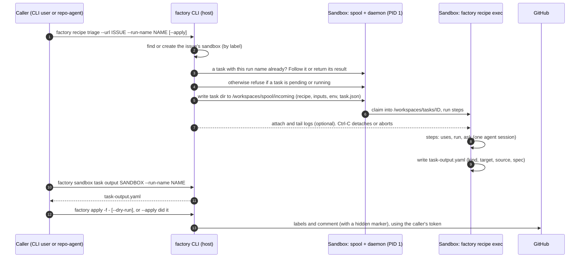

# Design Note: Recipes, Task Outputs and Apply

**Status:** Proposal. Triage is built this way end to end (#1707–#1725); plan is built as a recipe with a Plan output (#1727–#1729). Other task kinds are not yet built. Actions (part 5) are proposed, not built.

This note describes how a factory task should run and how its result should reach GitHub. A **recipe** describes the work. A **spooled task** runs it inside the sandbox, independent of whoever started it. The task leaves a **task output**, a typed document of what it found. **`factory apply`** is the one place that turns that document into GitHub writes, using the caller's identity.

---

## Background & Problem Statement

`factory triage` was typical of the per-verb tasks:

1. **Policy lived in a script per verb.** `triage_issue.sh` plus a rendered prompt were uploaded on every run. Changing the order of steps meant changing shell code, and every verb carried its own copy of the agent loop.
2. **The result was stdout.** The triage was printed between `ISSUE TRIAGE` banners. Callers such as repo-agent scraped it, so the banner format was a wire contract.
3. **The result belonged to the caller's process.** If the CLI died, the result was only in a file that one script knew the name of. repo-agent had to adopt orphaned runs by guessing at the "newest task directory with this prefix".
4. **The task could publish.** `--publish yes` applied labels and comments from inside the run. That made publishing hard to separate from producing, and hard to repeat safely.
5. **Each verb had its own sandbox.** Triage used `triage-<repo>-<N>`, separate from plan and fix in `fix-<repo>-<N>`, which split one issue's work and state across two sandboxes.

---

## Proposed Architecture



The pattern has five parts and one addressing rule.

### 1. Recipe: what runs

A recipe is YAML shaped like a GitHub Actions workflow and embedded in the factory binary. Built-in recipes are commands, for example `factory recipe triage`.

| Field | Meaning |
|---|---|
| `inputs:` | Named inputs with defaults and `required`. `type: instructions` takes repeatable `--instruction` values (a file, a repo path, or text). |
| `context:` | Rules sent to the agent once, at the start of the session. |
| `steps:` | `uses:` runs a named `lib.sh` step from a closed set. These are the only steps that get the token. `run:` is inline shell without the token, with inputs as `INPUT_*`. `ask:` is one prompt turn; all asks share one agent session. `capture:` saves a turn's reply to a file. |
| `outputs:` | Files the task's result consists of. |
| `task-output:` | `{kind, from, actions}`: the file that becomes the typed result, its kind, and what may be done with it (part 5). |
| `task-type:` | Makes the recipe its sandbox's main task, of that type, as plan and fix are: its state is `last-task-*`, and it lists as that type. Unset, the recipe is a side task, `recipe-<name>`. |

The sandbox runs the recipe with its own `factory recipe exec`. The CLI strips the fields it handles itself, such as `task-output:` and `task-type:`, before uploading (`recipe.ForSandbox`).

### 2. Spooled task: where and how it runs

- **Submission.** The client writes a task directory into `/workspaces/spool/incoming/`. The sandbox's daemon (PID 1) claims it, moves it to `/workspaces/tasks/<id>`, and runs it as its own child. The task does not depend on the client's connection or process.
- **Identity.** Task IDs are `recipe-<name>-<YYYYMMDD-HHMMSS>-<hex>`, so they sort by time. `task.json` records the ID, `run_name`, recipe, target URL, submission time and the output declaration.
- **Lifecycle.** A task is Pending, then Claimed, then Running, then Exited with an exit code. A dead PID reads as exited 137.
- **Tools.** `factory sandbox task list | attach | logs | status | output <sandbox | issue/PR URL>` work with any task. You can pick a task with `--task <id>` or `--run-name <id>`; the newest match wins.

### 3. Task output: the typed result

```yaml
apiVersion: factory.gemini.google.com/v1alpha1
kind: Triage
target:
  url: https://github.com/owner/repo/issues/123
source:
  sandbox: fix-repo-123
  task: recipe-triage-20261003-085545-13f9
  recipe: triage
  engine: gemini
spec:
  labels: [repo-agent, enhancement]
  priority: medium
  duplicates: []
  assessment: "…"
```

The runner wraps the declared file (`from:`) into this document as `task-output.yaml` in the task directory. When the runner predates task outputs, or doesn't know the kind, it leaves the file as it is, and `sandbox task output` wraps it on the client side. A new kind therefore does not need a new sandbox image. Runners older than this rule fail the task on a kind they don't know. The document is a draft: a person or program can read it, edit it, and keep it. Nothing has happened on GitHub at this point.

### 4. Apply: the one publisher

`factory apply -f <file|->` parses the document according to its kind and performs that kind's writes using the **caller's** token. Tasks never write to GitHub; the one exception is git push and PR creation inside the sandbox, as before.

- **Dry run.** `--dry-run` prints what it would write and writes nothing.
- **Idempotent.**
  - A comment carries a hidden marker, `<!-- factory:task-output kind=… task=… -->`, and apply skips posting if a comment with that marker already exists.
  - Adding labels is idempotent anyway.
- **Kind-aware.** Each kind decides which targets it accepts; for example, a Triage refuses a PR URL.

| Kind | Recipe | Apply |
|---|---|---|
| Triage | `triage` | Adds the suggested labels and comments the assessment on the issue. |
| Plan | `plan` | Comments the plan on the issue. The plan is also left at `/workspaces/plan-issue-<n>.md`, where `fix --with-plan`, repo-agent's plan editor and a continued chat read it. |

### 5. Actions: what can be done with a result

**Proposed.** Today each caller hard-codes what a result offers: the board knows a triage has Edit, Publish and Reject, and a plan has Edit, Feedback, Approve and Reject. Instead, a task output carries its **actions**, so a UI renders whatever the document declares and a new kind needs no new UI code.

```yaml
# recipes/plan.yaml
task-output:
  kind: Plan
  from: plan-output.md
  actions:
    - verb: edit
      field: spec.markdown
      format: markdown
    - verb: comment
    - verb: run
      run: fix
      label: Fix with this plan
    - verb: reject
```

The runner copies the declaration into the document, next to `spec`:

```yaml
kind: Plan
target: {url: https://github.com/owner/repo/issues/123}
spec: {markdown: "…"}
actions:
  - {verb: edit, field: spec.markdown, format: markdown}
  - {verb: comment}
  - {verb: run, run: fix, label: Fix with this plan}
  - {verb: reject}
```

**Verbs come from a registry.** An action names a verb; it never carries code, a command line, or a URL. The registry starts as the built-in verbs in `pkg/taskoutput`; operators can extend it with verbs defined as REST calls (see *Extensible verbs* below), but a task output can only name them. There are three classes of verb:

| Class | Verbs | Who executes it | Meaning |
|---|---|---|---|
| Apply | `comment`, `label`; later `review`, `close-duplicate` | `factory apply --action <verb>` | A write to the document's `target`, using the caller's token, idempotent as in part 4. |
| Follow-up | `run` | `factory apply --action run` | Starts the named follow-up task (`fix` → `factory fix --with-plan` today, a recipe later) in the target's sandbox, with this document as its input. |
| Draft | `edit`, `reject` | The caller that keeps the draft | `edit` names the field and format to edit (`spec.markdown` as markdown; `spec` as YAML for a Triage). `reject` discards the draft. factory executes neither; from the CLI, editing is editing the file before `apply -f`, and rejecting is not applying. |

The registry also records which kinds each verb accepts: for example, `label` is a Triage verb, and `comment` refuses a PR target where the kind does.

**Who decides what.** The document is written next to an agent that read untrusted issue text, so it can narrow what is offered, but never widen it:

| Layer | Decides | Example |
|---|---|---|
| Registry (factory code) | What a verb does, and which kinds accept it | `comment` posts once with the marker |
| Recipe, copied into the document | Which of those verbs this result offers | A plan offers `run: fix`; an audit-only plan recipe might not |
| Caller, at read time | Which offered verbs are available now | Already posted: no `comment`. The viewer can't write to the repo: no `run`. The sandbox is busy: `run` is disabled. |

A UI shows the intersection. A verb it doesn't know is hidden, as the runner ignores a kind it doesn't know.

**Rules:**
- **Validated twice.** `recipe` validation rejects a recipe whose actions name an unknown verb, or a verb its kind doesn't accept. `apply --action` refuses a verb the document doesn't offer, or one the registry doesn't accept for its kind.
- **Defaults.** A document without `actions:` (from an older runner, or written by hand) gets its kind's defaults from the registry: Triage `edit, label, comment, reject`; Plan `edit, comment, run fix, reject`.
- **`factory apply -f` without `--action`** runs the document's apply-class actions, which is today's behaviour: a Triage still gets labels and a comment.
- **Agent-filled parameters are later.** An agent may eventually fill in a declared verb's parameters, for example `close-duplicate: {of: 123}`. It may never add a verb the recipe didn't declare; the runner enforces that when it writes `task-output.yaml`.

**Extensible verbs (follow-up).** A verb is, at bottom, a REST call against the target: which endpoint to call, with which parameters. Rather than adding Go code for each new verb, the registry accepts verb definitions of that shape:

```yaml
# A verb definition: in factory's config, or a recipe's verbs:. Never in a task output.
verbs:
  close-duplicate:
    class: apply
    kinds: [Triage]
    label: Close as duplicate
    params:
      of: {type: integer, required: true}    # from the action, or filled by the agent
    auth: github                             # the caller's GitHub token
    calls:
      - method: POST
        path: /repos/{{ .Target.Owner }}/{{ .Target.Repo }}/issues/{{ .Target.Number }}/comments
        body: {body: "Duplicate of #{{ .Params.of }}"}
        idempotency: marker                  # skip if the marker comment exists
      - method: PATCH
        path: /repos/{{ .Target.Owner }}/{{ .Target.Repo }}/issues/{{ .Target.Number }}
        body: {state: closed, state_reason: duplicate}
```

- **Where definitions live.** In config the operator controls (factory's config; a board's verb set for repo-agent), or in a recipe, which is as trusted as whoever runs it. Never in the task output, which is written next to an agent that read untrusted text.
- **What a template may read.** The document's `target` (owner, repo, number, URL), its `spec` fields, and the action's typed `params`. Values are escaped for where they go: path segments are path-escaped, and bodies are built as JSON, never by string concatenation.
- **Where calls may go.** `auth: github` sends the caller's token only to the GitHub API host, and `path` is relative to it. A verb that calls another service names a host the operator has allowed and a credential of its own; the GitHub token never leaves for another host.
- **Parameters are typed and validated** before any call: the type, `required`, and an optional `enum` or pattern. A document or click that supplies a parameter the definition doesn't declare is refused.
- **Idempotency is declared**, for example `marker` (a hidden comment marker, as part 4) or `natural` (the call is idempotent itself, as adding labels is). A verb without either is offered only for explicit clicks, never by `apply -f` without `--action`.
- **Dry run** prints each resolved call, method, path and body, without sending it.
- **Built-in verbs stay Go code** where they need logic a template can't express (finding an existing marker comment, refusing a PR target), but are described by the same definition shape, so callers render built-in and defined verbs alike.

### Addressing: one sandbox per issue

An issue's triage, plan, fix and recipes all run in one sandbox.

- **Finding it.** factory labels the sandbox `factory.gemini.google.com/repo` and `/issue`, and callers find it by those labels rather than by name.
- **State.** A side task records its state in `sandbox.gemini.google.com/<type>-task-state`, for example `recipe-triage-task-state`. It never touches `last-task-*`, which stays the plan's or fix's. A recipe with `task-type:`, such as plan, is the main task and records its state in `last-task-*`.
- **One at a time.** A sandbox with a pending or running task refuses another, because two agents in one checkout would get in each other's way.

---

## How callers run it

| Mode | Command | Ctrl-C / caller dies | Rerun |
|---|---|---|---|
| Foreground | `factory recipe triage --url U` | Aborts the task (`--abort-on-cancel`, the default) | New task; with `--run-name`, the same task |
| Detached | `… --detached`, later `sandbox task status`, then `output` | Nothing to interrupt | Read by `--run-name`, or rerun with it |
| Wait and apply | `… --apply [--dry-run]` | Stops waiting; the task keeps running | Picks up the newest run of this recipe and URL: waits if it's running, applies if it exited 0 and isn't yet applied (`task-output.applied`) |
| Program (repo-agent) | `… --run-name NAME --abort-on-cancel=false`, then `sandbox task output --run-name NAME` | The task survives; the prober adopts its `task-output.yaml` | Same run name finds the same task |

**Run names** are chosen by the caller and opaque to factory. They contain identifiers only, because anyone in the sandbox can read them. They are recorded in the task's `task.json` (`run_name`). The task directory keeps its generated, time-sorted name, because a run name may contain `/`.

**A run name is one run's, so launching with one is idempotent.** `factory recipe … --run-name NAME` looks for a task recorded under NAME before starting anything:

| Task under NAME | Without `--apply` | With `--apply` |
|---|---|---|
| None | Start one | Start one, wait, apply |
| Pending or running | Follow it (`--detached`: print how to) | Wait for it, apply |
| Exited 0 | Print its outputs | Apply, unless already applied |
| Failed | Error: retry under a new name | Error: retry under a new name |
| Another recipe or URL | Error: the name is taken | Error: the name is taken |

A run name takes precedence over `--apply`'s "newest run of this recipe and URL" rule. repo-agent uses `request/<Request UID>` for a click (one task per click) and `auto/<board>/<issue>/<launch time>` for auto-triage, one per attempt, so a failed run is retried rather than returned.

---

## Worked example: triage

| Step | PRs | What changed |
|---|---|---|
| Recipe model | #1707–#1710 | `triage.yaml` replaces `triage_issue.sh` with steps. `recipe run`, `outputs:`, and the default branch checked out from upstream. |
| Spool and task tools | #1714–#1716 | The daemon claims spooled tasks. `sandbox task list/attach/logs/status/output`. |
| Task output and apply | #1717, #1718 | `task-output.yaml` (kind Triage), `factory apply`, and `factory recipe triage`. |
| One sandbox per issue | #1719 | Triage runs in the issue's sandbox, found by label, with its own `<type>-task-state`. Repeatable `--instruction`. |
| Wait, apply, resume | #1720 | `recipe … --apply`, which picks up after an interruption. |
| repo-agent | #1721 | Runs `recipe triage --run-name` and reads the result by run name instead of from stdout banners. |
| Idempotent launch | #1725 | A rerun with the same run name follows or returns that task instead of starting another. |
| Removal | #1722, #1723 | `factory triage`, its script and prompt, and repo-agent's support for old `triage-*` sandboxes and old annotations are gone. |

---

## Adding a new kind

1. **Write the recipe.** Its steps must produce one file, declared as `task-output: {kind: X, from: x-output.yaml}`. Tell the agent in `context:` not to write to GitHub.
2. **Add the kind to `pkg/taskoutput`.**
   - A parser for the agent's raw output.
   - A typed spec.
   - `apply` logic. Make it idempotent with a marker, or with a natural key such as the commit SHA.
   - The kind's verbs and default actions in the registry (part 5); declare the recipe's actions in its `task-output:`.
3. **Pin the target to what the task saw.** For example, add `target.commit` for a Review, so that applying a stale review to newer code is refused or flagged.
4. **Update callers.** Start the task with a run name and read the output by that name. Leave publishing to `apply`, and never publish from inside the task.

Plan is built: `factory recipe plan` (`task-type: plan`) revises the plan it finds in the sandbox, and `fix --with-plan` follows it. repo-agent runs it (#1728), and `factory plan`, its script and prompt are gone.

Planned kinds, in order:
- **Review.** Pin `target.commit`; submit as a pending review or a comment.
- **PullRequest.** Link and alias an existing PR, and add labels.

After those, repo-agent's drafts become the documents themselves, published through the same applier. Review should be the first kind declared with actions from the start.

---

## Building actions

Factory first, then repo-agent. The factory phase stands alone: `apply --action` is useful from the CLI. repo-agent then only consumes factory's commands and documents, so no dependency points from factory to repo-agent.

**Phase 1: factory.**
1. Add `Action {verb, field, format, run, label}` to `taskoutput.Decl` and `Document`, the verb registry, and validation of a recipe's actions.
2. Have the runner copy `actions` into `task-output.yaml`; client-side wrapping copies them from the client's recipe. A document without actions gets the kind's defaults.
3. Add `factory apply --action <verb>` with the apply and follow-up verbs. Split Triage's apply into `label` and `comment`. Plain `apply -f` stays as it is.
4. Declare actions in `triage.yaml` and `plan.yaml`, and print them in `sandbox task output`.

**Phase 2: repo-agent.**
1. Keep the task output document itself as the draft (a `task-output` annotation), instead of converting it to a `triage:` block or plan markdown. Editing writes back into the document's `field`.
2. Return `actions: [{verb, label, enabled, reason}]` on each work item: the document's actions intersected with the board's state (published, rejected, approved, a task running, the viewer's access).
3. One endpoint, `POST /board/:board/issues/:id/actions/:verb`. Draft verbs act on the annotation. Apply and follow-up verbs file a Request that the controller executes with `factory apply --action`, using the clicker's token, as clicks already are executed. The review-api image does not carry the factory binary.
4. The UI renders buttons and the editor from `actions`, replacing the hard-coded triage and plan controls. Board-only steps that are not about the result, such as plan feedback (a rerun with `--feedback`), stay board verbs.
5. Remove the board's own GitHub writes for triage publish once `comment` and `label` run through `apply`.

**Phase 3: extensible verbs (follow-up).**
1. In factory: the verb definition schema, loading definitions from config and from a recipe's `verbs:`, the template and parameter validation, the host and credential rules, and `apply --action` executing defined verbs (with `--dry-run` printing the resolved calls).
2. Describe the built-in verbs in the same shape, so `sandbox task output` and callers list every verb the same way.
3. In repo-agent: a board's verb set (which defined verbs its documents may offer), and the work item's `actions` carrying each verb's label and parameters, so the UI can prompt for a parameter such as `of`.

---

## Pitfalls & Mitigations

| Pitfall | Mitigation |
|---|---|
| **Image skew.** A reused sandbox keeps the image it was created with. An image without `factory recipe exec`, or with an older recipe schema, fails the task. | Decided: recreate the sandbox. There is no fallback to old task scripts, and recipes are not stripped down for old runners. The spool falls back to envd only for sandboxes whose daemon doesn't claim tasks. |
| **The applied marker is best-effort.** `task-output.applied` is written after apply. If writing it fails, a rerun applies again. | Apply is idempotent through the comment marker and label semantics, so applying twice is harmless. |
| **Agent output is untrusted.** | Apply acts only on the parsed fields of a known kind, against the document's `target`, using the caller's token. A dry run shows exactly what would be written. |
| **Actions in an untrusted document.** An agent, or an injected issue, could try to offer a destructive action. | Actions name verbs from the registry and carry no code. A document can only narrow what its recipe declares, `apply --action` re-checks the verb against the kind, and the caller still decides what is available. |
| **Defined verbs make REST calls.** A definition, or values interpolated into it, could reach an unintended endpoint or leak the token. | Definitions come only from operator config or a recipe, never a task output. Values are escaped and typed. The GitHub token goes only to the GitHub API host; other hosts need the operator's allowance and their own credential. |
| **Two tasks in one sandbox.** | The busy check refuses to start a second one. Side-task state annotations keep each task's status separate. |
| **"Newest" is ambiguous** when several runs exist. | Programs use `--run-name`. "Newest run of this recipe and URL" is only the human `--apply` resume rule. |

---

## Non-goals

- **No change to overseer or `factory watch`.** They keep the classic task model, and none of this is required for them.
- **No caller-chosen task IDs.** Task IDs stay generated and timestamped; the run name is the caller's handle, and it makes launching idempotent.
- **No GitHub writes from tasks.** Git push and PR creation by fix-type tasks remain the only exception.
