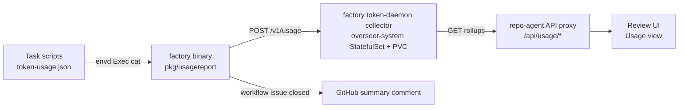

# Token Usage Collection Design Note

This document describes how gemini-cli token usage produced inside sandboxes is centrally collected, aggregated per issue/PR/workflow, surfaced in a dashboard, and summarized on GitHub.

---

## 1. Overview & Goals

Every task script accumulates gemini-cli stats into `<taskDir>/token-usage.json` (and `llm-usage.json`) inside the sandbox PVC (see `record_gemini_usage` in `factory/pkg/tasks/*.sh`). That data was previously stranded: nothing read it, and sandbox cleanup destroyed it.

Goals:
* **Durability**: usage must survive sandbox and overseer pod deletion.
* **Aggregation**: tokens per issue/PR (across all its tasks) and per workflow (across all issues/PRs linked to the workflow).
* **Zero task risk**: reporting is best-effort and disabled by default; a task can never fail because of usage collection.
* **No cross-module coupling**: factory/overseer do not import repo-agent; the JSON wire format is the only contract. Both producer (`factory/pkg/usagereport`) and collector (`factory/pkg/tokenusage`) live in the factory module and share one set of types; overseer only carries the deployment manifests.

---

## 2. Architecture



* **Collector** (`factory/pkg/tokenusage`, run as the hidden `factory token-daemon` command): plain net/http service storing records in a JSONL append log on a PVC (`records.jsonl`), with a full in-memory index rebuilt by replay at startup. Deployed by `overseer/k8s/token-usage.yaml` as Service + StatefulSet `token-usage` in `overseer-system`, reusing the overseer image (which bundles the factory binary) with `command: ["factory", "token-daemon"]` — no separate image to manage.
* **Producer** (`factory/pkg/usagereport`): reads usage files over envd (`cat <taskDir>/token-usage.json || cat <taskDir>/llm-usage.json`) and POSTs a `UsageRecord` to `$COLLECTOR_URL`. No-op when `COLLECTOR_URL` is unset; failures only log warnings.
* **Wiring**: the overseer controller injects `COLLECTOR_URL` (default `http://token-usage.overseer-system.svc.cluster.local:8080`) into overseer sandboxes; `factory watch` and its re-exec'd subcommands inherit it.

---

## 3. Usage Records & Idempotency

Each record carries context for aggregation plus the stats payload:

```json
{
  "key": "<sandbox>:<taskDir>",
  "repo": "owner/name",
  "taskType": "fix|review|investigate|address|iterate|adopt|agent",
  "taskDir": "/workspaces/tasks/fix-...", "sandbox": "fix-repo-42",
  "issue": 42, "pr": 101, "issues": [42],
  "workflow": "issue-42", "workflowName": "greenfield",
  "recordedAt": "RFC3339",
  "stats": {"models": {"<model>": {"api": {...}, "tokens": {...}}}}
}
```

The `key` is the idempotency key: re-posting upserts (append to the log; last line wins on replay). This makes the double-harvest strategy below safe.

---

## 4. Harvest Strategy: Push + Sweep

1. **Push (rich context)**: each command harvests right after its task completes — `fix.go` (issue + created PR), `pr.go` investigate/address-comments/iterate/adopt (PR + issues referenced by the PR via `getReferencedIssues`), `review.go` (PR), `agent.go` (workflow session/name, issue parsed from `issue-N`, created PR).
2. **Sweep (safety net)**: the watch-loop cleanup functions (`cleanupClosedPRSandboxes`, `cleanupClosedIssueSandboxes`, `cleanupStaleIdleSandboxes`) call `HarvestSandbox` immediately before `DeleteSandbox`, listing all `/workspaces/tasks/*/` dirs and harvesting each. Context is recovered from sandbox labels (`factory.gemini.google.com/pr`, `factory.gemini.google.com/workflow`) and the `wf-issue-N` naming convention. This catches detached, crashed, or timed-out tasks whose push hook never ran.

---

## 5. Rollups

The three rollups are **mutually exclusive** — every record is counted in exactly one, matching the sandbox categories shown in the dashboard:

* **Per workflow** ("Workflow Issues"): group by `workflow` session; a session `issue-N` also absorbs untagged records that reference issue N, so PR tasks spawned by a workflow count toward it.
* **Per issue** ("Issue / PR sandboxes"): remaining records count toward issue N if `issue == N` or N is in `issues` — the issue sandbox plus any PR work it led to. Rows with linked PRs are labeled `#N / PR #M`. Issues owned by a workflow session are excluded.
* **Per PR** ("PR sandboxes"): what is left — standalone PR work (reviews, investigations, adoptions) with no issue or workflow linkage.

All rollup list responses include the per-task `records` (with `taskType`, `sandbox`, and `recordedAt`) for drill-down in the dashboard.

Two additions on top of the record rollups:

* **Daily usage** (`GET /v1/usage/rollups/daily`): records grouped by the UTC day of `recordedAt`. `recordedAt` is stamped when a task's usage is **first** pushed and preserved across upserts (a later sweep re-post cannot move usage to a different day).
* **Subjects** (`POST /v1/subjects`, stored in `subjects.jsonl`): GitHub metadata of the entity usage is attributed to — `issue-<n>` / `pr-<n>` keys with `state` (open/closed), `createdAt`, and `closedAt`. Producers upsert subjects from the task hooks (open state, creation time) and from the watch-loop cleanup functions (closed state, close time); merge semantics never let an empty field blank out a known value. Rollups join on the subject key so the dashboard can show open/closed status and age (creation→close, or creation→now while open).

Endpoints: `GET /v1/usage/rollups/{issues,prs,workflows}[?repo=]` and `GET /v1/usage/rollups/workflows/{session}` (detail with per-task records).

---

## 6. Workflow Summary Comment

When `cleanupClosedIssueSandboxes` finds a closed workflow issue (a `wf-issue-N` sandbox), it performs a final harvest and then calls `PostWorkflowSummaryIfNeeded`, which:

1. Fetches the workflow rollup from the collector (skips silently if no usage exists).
2. Calls `POST /v1/workflows/issue-N/mark-summarized` — an atomic check-and-set persisted in `summarized.json`. Only the first caller gets `alreadyPosted: false`.
3. Posts a markdown table (per-model requests/errors/input/output/cached/thoughts/total + task count + linked PRs) as an issue comment.

The CAS guarantees at-most-once commenting across watch-loop restarts. Known limitation: if the workflow issue closes after its sandbox is already gone, no comment is posted (the hook lives in sandbox cleanup).

---

## 7. Dashboard

The review UI (`repo-agent/review-ui/ui/src/TokenUsage.js`, a "Usage" view in `App.js`) shows per-workflow (expandable to per-task records), per-issue, and per-PR tables with 30s polling. It fetches through an authenticated GET-only reverse proxy in the repo-agent API (`GET /api/usage/*path` → collector), configured by `COLLECTOR_URL` on `repo-agent/k8s/api-deployment.yaml`. The coupling is HTTP-only; factory/overseer never import repo-agent code.
