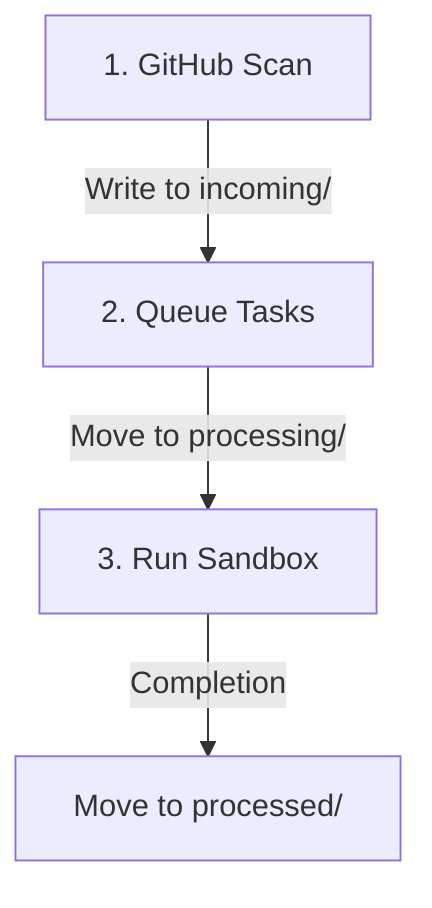

# Watch Scanning & Task Orchestration Design Reference

This document details the unified design, architecture, and behavior of the `factory watch` background loop, which serves as the core scanning and orchestration daemon of the AI Factory.

---

## 1. Overview & Goals

The watch loop provides continuous monitoring of a target GitHub repository, transforming external events (issues, comments, and CI failures) into isolated coding tasks running inside cluster sandboxes.

The key goals of the watch loop design are:
* **Decoupled Scanning and Execution**: Separating event discovery (scanning) from task runs using a filesystem-based queue.
* **Smart Filtering**: Minimizing unnecessary tasks and API rate limits by skipping duplicate work (e.g., issues that already have open PRs).
* **Multi-Identity Coordination**: Automatically routing task execution to specific bot user accounts based on role mappings and ownership requirements.

---

## 2. Watch Loop Architecture

The daemon executes periodically (default: every 2 minutes) and follows a three-stage pipeline:

1. **GitHub Scan**: Fetches open issues, open PRs, comments, reviews, and CI statuses from GitHub.
2. **Queue Tasks**: Evaluates conditions, resolves assignees, and writes task yaml specs to the `incoming/` queue folder.
3. **Run Sandbox**: Reads the queue, moves the task to `processing/` atomically, runs the child `factory` CLI command, and finally moves the task and log files to `processed/`.

---

## 3. Work Item Discovery & Deduplication Rules

The watcher uses the GitHub API to discover open issues and pull requests, applying specific filters based on labels, creators, and assignees. It automatically paginates all API queries to fetch all pages of issues, PRs, reviews, and comments, bypassing default API limits.

### A. Issue Discovery (Bugs & Chores)
The watcher fetches open issues matching any of the following criteria:
1. **Assigned to Watcher**: Issues assigned to the watcher bot's login username.
2. **Labeled with Trigger Label**: Issues that have the trigger label (e.g., `factory`, `overseer`).
3. **Created by Watcher**: Open issues created by the watcher bot account itself.

*Deduplication Filters*:
* **MinNumber Filter**: Ignored if the issue or PR ID is less than the configured `minNumber` threshold.
* **PR Filter**: The watcher ignores issues that are actually Pull Requests (where `PullRequestLinks != nil`).
* **Linked PR Check**: The watcher searches all open PRs in the repository. If an open PR references the issue number in its title, description, branch name, or via the GitHub Timeline API, the issue is skipped to prevent duplicate work.

### B. Pull Request Discovery
The watcher fetches open Pull Requests matching:
1. **Assigned to Watcher**: Pull Requests assigned to the watcher bot.
2. **Labeled with Trigger Label**: Pull Requests labeled with the trigger label.
3. **Bot Pool Origin**: Only PRs created by bot accounts defined in the configured bot pool are processed. Third-party or human PRs are ignored unless they are explicitly allowlisted.

---

## 4. Task Dispatch Matrix

Once the watcher has consolidated the active issues and PRs, it performs check-status queries to map them to specific task types:

| Item Type | Condition | Task Type | Spawned Command | Identity Selection |
| :--- | :--- | :--- | :--- | :--- |
| **Issue** | Open issue assigned/labeled | `issue-fix` | `factory fix` | Mapped pool bot / Load-balanced coder |
| **PR** | CI check runs failed (Phase 3) | `pr-investigate` | `factory pr investigate` | Match PR author (must be in `coder` pool) |
| **PR** | New comment or review (Phase 2) | `pr-comments` | `factory pr address-comments` | Match PR author (must be in `coder` pool) |
| **PR** | Merge conflicts / out-of-date (Phase 1) | `pr-iterate` | `factory pr iterate` | Match PR author (must be in `coder` pool) |
| **PR** | Opened by third-party bot on allowlist | `pr-review` | `factory pr review` | Random user from `reviewer` pool |
| **PR** | Markdown workflow checklist file reference | `agent-chore` | `factory agent create` | Default fallback or mapped role |

---

## 5. Queueing & Concurrency Control

To ensure robustness, the watcher operates on a directory-based queue (`incoming/`, `processing/`, `processed/`):

1. **Scan Mode (`--mode=scan`)**: Performs the queries, builds the task specifications, and writes them into `incoming/<task-id>.yaml`.
2. **Run Mode (`--mode=run`)**: Periodically reads `incoming/` directory. It selects the next task, moves it atomically to `processing/`, runs the corresponding `factory` CLI command, and writes the output logs to `processing/<task-id>.log`.
3. **Completion**: Once the CLI command exits:
   * If successful: The task file and logs are moved to `processed/`.
   * If failed: The task status is marked as `Failed` with the error trace, and moved to `processed/`.

---

## 6. PR Processing Event Phases & Retry Logic

When processing a PR, the scan evaluates conditions and queues tasks in three phases:

### Phase 1: Rebase / Merge Conflicts (`pr-iterate`)
* **Trigger**: The PR is in a conflicting merge state (`Mergeable == false`).
* **Assignment**: The bot user stays assigned to the PR on GitHub while the rebase task is executing.

### Phase 2: Review Feedback / Comments (`pr-comments`)
* **Trigger**: A new comment or review is posted after the PR's last commit time and after `lastCommentAddressedTime`. Or, a pool bot is manually assigned to the PR as an override trigger.
* **Bot Filtering (`shouldIgnoreUser`)**:
  * Own watcher bot (`githubLogin`) and PR author comments are ignored.
  * System bots (matching `prow`, `-bot`, `-robot`, or `[bot]`) are ignored by default.
  * Allowlisted review bots (e.g. `reviewbot-robot` in `allowlistedBots`) are NOT ignored.
* **Assignment**: The bot user stays assigned to the PR on GitHub while addressing comments.

### Phase 3: CI Check Failures (`pr-investigate`)
* **Trigger**: Check runs or status checks for the head commit have failed.
* **Check Run Deduplication**: Check runs are deduplicated by name, keeping only the latest run (highest ID), ensuring older cancelled/failed runs do not block the PR if a newer run succeeded.
* **Retry Count**: If `investigationCount >= 3` since the last commit, it posts a "giving up" message and halts retries.
* **Retry on Recovery**: If the previous investigation task is in `processed/` but has status `"Failed"`, the watcher ignores the SHA check and allows retrying the task.
* **Assignment**: The bot user remains assigned to the PR while the task is executing. If it reaches the retry limit and gives up, it explicitly unassigns itself to request human review.

---

## 7. Identity & Assignee Resolution (`selectUserForTask`)

When queueing tasks, the daemon resolves which bot identity should run the task:
1. **Sandbox Pinning**: Checks if a running sandbox already exists for this task and pins the user label from that sandbox.
2. **Issue Assignees**: Inspects the issue's assignees to match any bot in the configured role pool.
3. **PR Author Mapping**: Matches the PR author against the configured role users:
   * If the PR author is in the `agent` pool, the task runs as that agent bot.
   * If the PR author is in the `coder` pool, the task runs as that coder bot.
4. **Fallback**: Falls back to the watcher daemon's own account.

---

## 8. Crash Recovery & Git Sync

* **Crash Recovery**: On watch daemon startup, any tasks found in the `processing/` directory are moved back to `incoming/`. The daemon reads their specifications (including the resolved `assignee`) and executes them.
* **Git State Sync**: At the end of every watch loop cycle, if any changes were made to `/overseer/queues`, the daemon automatically adds, commits, and pushes them back to the state branch (e.g. `overseer`) to keep the remote repository synced.
