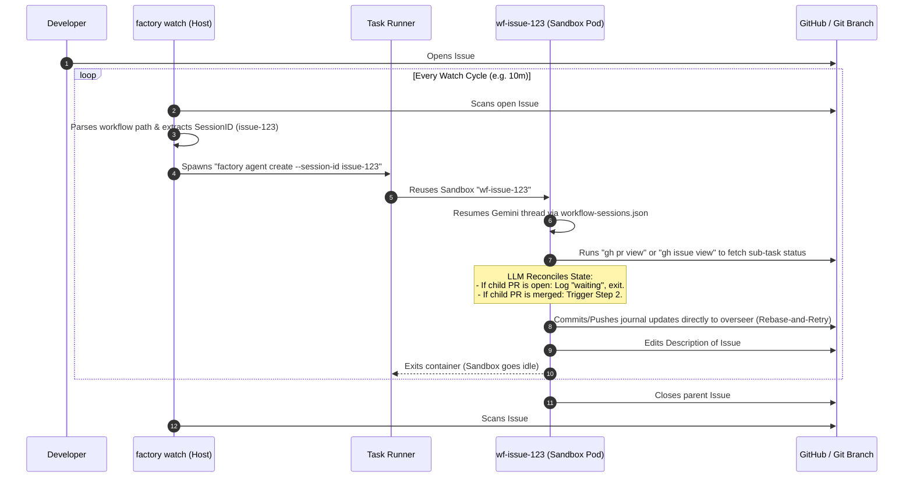

# Design Note: LLM-Driven Workflow Orchestration & Session Reconciliation

This design note outlines the architecture for persistent, multi-step workflow execution (e.g., repository migration, kind-by-kind checklist resolution) driven by LLMs, with parallel session isolation and Git/GitHub state reconciliation.

---

## Background & Problem Statement
Standard agents in `factory` are designed to execute single-shot tasks (e.g., fixing a code bug or running a chore script) and terminate, producing a Pull Request.

In contrast, a **Workflow** is a long-running, multi-step process with dependencies that spans hours or days. Examples include migrating API groups from one version to another kind-by-kind, or executing multi-stage test verifications. To support these processes:
1.  **Durable Session State**: The agent's local chat context and files must persist across pod restarts and sequential executions.
2.  **Parallel Execution**: A single repository must support multiple concurrent workflow runs of the same type (e.g., migrating `SpannerInstance` and `SpannerDatabase` in parallel).
3.  **Conflict-Free Git Pushes**: Parallel runs must commit progress logs to the `overseer` branch without fast-forward conflicts.
4.  **Reconciliation Loop**: The system must periodically wake up the agent to check the status of sub-tasks (e.g., checking if a child PR was merged) and proceed to the next step.

---

## Proposed Architecture: Reconciliation Loop & Session Mapping

Rather than keeping agent containers running continuously (wasting CPU/memory and risking connection flakes), we implement a **reconciliation loop** modeled after Kubernetes controllers.



---

## Technical Details

### 1. Distinguishing Workflows from Regular Tasks

To prevent every issue that references a skill or prompt from launching a persistent workflow, `factory watch` performs a two-tier verification:

1.  **Directory Convention Check**: Any path containing `/workflows/` (e.g. `.agents/workflows/checklist-for-kind.yaml`) is automatically classified as a workflow.
2.  **Content Analysis Check**: If the path does not reside in a `/workflows/` folder (e.g. it is located under `.gemini/skills/checklist-for-kind/prompt.md`):
    *   `factory watch` dynamically fetches the first 2,000 characters of the referenced file from GitHub using the Repository GetContents API.
    *   It scans the file header/front-matter for workflow keywords: `mode: workflow`, `mode: "workflow"`, or `AGENT_MODE=workflow`.
    *   If found, it is classified as a workflow.
3.  **Fallback**: If neither condition is met, the path is assumed to be a standard task prompt, and the issue is queued as a standard single-shot `issue-fix` task.

### 2. Session Isolation & Sandbox Naming

To avoid long names that exceed Kubernetes' 63-character limit:
*   **Sandbox Name**: When `SessionID` matches `issue-<num>`, the sandbox is named `wf-issue-<num>`.
*   **Sandbox Label**: We inject a label `factory.gemini.google.com/workflow: <workflow-name>` (e.g., `checklist-for-kind`) on the Sandbox CR to keep track of the workflow type.

### 3. Dynamic Gemini Session Mapping

Gemini session files are named dynamically with UUIDs in the persistent home directory (`/workspaces/.home/.gemini/tmp/`). To resume the same thread across sequential reconciliation runs:
1.  We maintain a local JSON registry inside the persistent volume: `$HOME/.gemini/workflow-sessions.json`.
2.  Before running Gemini, the script `run_agent.sh` checks:
    ```bash
    INTERNAL_ID=$(jq -r --arg sid "$SESSION_ID" '.[$sid] // ""' "$MAPPING_FILE")
    ```
    If an internal ID exists, it resumes the thread using `gemini --yolo --resume $INTERNAL_ID`.
3.  On task completion, if a new session was started, the script writes the mapping back:
    ```bash
    jq --arg sid "$SESSION_ID" --arg iid "$INTERNAL_ID" '.[$sid] = $iid' "$MAPPING_FILE"
    ```

### 4. Git Push Conflict Mitigation (Rebase-and-Retry)

When parallel sessions commit their logs to the `overseer` branch, they push to the same remote. To prevent push failures:
1.  **Disjoint Files**: Sessions write to unique journal files named after their issue ID (e.g., `session-issue-123.md`), making Git merges automatic.
2.  **Rebase-and-Retry Loop**: When pushing changes, `run_agent.sh` executes a loop that pulls with rebase, rebases local commits, and pushes, with randomized backoff:
    ```bash
    while [ $RETRY_COUNT -lt 5 ]; do
        if git pull --rebase origin overseer && git push origin overseer; then
            break
        fi
        sleep $((RANDOM % 5 + 2))
    done
    ```

### 5. Hybrid State Syncing for Developer Visibility

To keep developers informed of the workflow's current state:
1.  **Authoritative State**: Stored in Git in session-specific Markdown journals (e.g. `.gemini/workflows/checklist-for-kind/session-issue-123.md`).
2.  **Visual Progress State**: The agent uses the `gh` CLI to dynamically edit the description/body of the triggering GitHub issue (e.g., `#123`). The agent keeps a markdown checklist updated, showing completed sub-tasks, pending steps, and active PR links.
