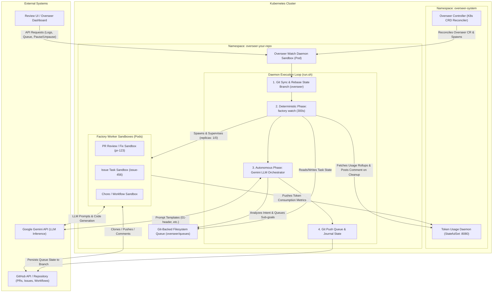
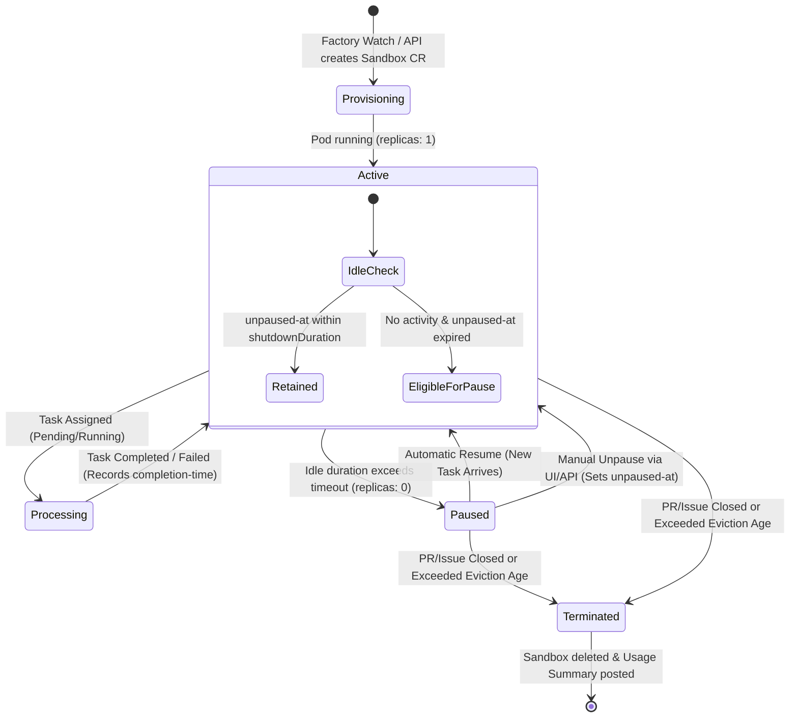

# Overseer & Factory Architecture: Hybrid Deterministic and Autonomous Repository Supervision

This document outlines the architectural interaction between **Overseer** (the Kubernetes-native autonomous orchestration loop) and **Factory** (the deterministic workhorse engine, CLI tool, and sandbox supervisor). Together, they establish an end-to-end, multi-agent repository supervision framework running inside Kubernetes.

---

## 1. Executive Summary

Modern software repositories generate continuous streams of events: Pull Requests requiring review, bug reports needing investigation, background maintenance chores, and evolving user requirements. Traditional rigid continuous integration (CI) bots struggle with open-ended tasks and dynamic goals, while pure Large Language Model (LLM) agents can lack deterministic reliability and structured state retention.

The project solves this by combining two complementary paradigms:
1. **Factory (Deterministic Engine)**: A compiled Go runtime and CLI that supervises task queues, manages isolated worker sandboxes in Kubernetes, executes deterministic pre-flight checks, runs background chores, and collects telemetry.
2. **Overseer (Autonomous Arbiter & Controller)**: An agentic loop and Kubernetes operator that wraps `factory`. It pairs structured task reconciliation with an autonomous LLM phase (`gemini-cli`) capable of interpreting user intent from PRDs, issues, and system state to dynamically orchestrate specialized sub-agents.

---

## 2. System Architecture Diagram



---

## 3. Core Components & Responsibilities

### 3.1 Overseer Controller (`overseer-controller`)
- **Custom Resource Definition (CRD)**: Reconciles `Overseer` custom resources (`overseer.gemini.google.com/v1alpha1`). Each CR represents an active repository supervision mandate.
- **Namespace & Tenant Isolation**: For each monitored repository, the controller provisions a dedicated Kubernetes namespace (`overseer-<repo>`) to ensure absolute isolation of secrets, compute resources, and git checkouts.
- **Daemon Provisioning**: Deploys the central **Overseer Watch Daemon Sandbox** within the target namespace and injects required Kubernetes Secrets (Gemini API tokens, GitHub Personal Access Tokens, robot identities) and custom configurations (`.factory.cfg`).

### 3.2 Overseer Watch Daemon (`run.sh` & `bootstrap.sh`)
- **Bootstrap Phase**: Initializes workspace directories, removes lingering drain/do_not_process marker files from previous terminations, and prepares prompt templates.
- **Dual-Loop Orchestration**: Runs the perpetual monitoring loop that alternates between deterministic queue execution (`factory watch`) and exploratory LLM goal-seeking (`gemini-cli`).
- **State Checkpointing**: Manages the git state-tracking branch (named after `triggerLabel`, default `overseer`), rebasing onto `main`/`master` and force-pushing updated queue records at the end of every cycle.

### 3.3 Factory Engine (`factory`)
- **Compiled Runtime**: A standalone Go binary packaged inside the Overseer container image and worker sandboxes.
- **Command Architecture**:
  - `factory watch`: The deterministic supervisor loop that scans open PRs, issues, and workflow definitions, executing pending jobs sequentially or concurrently via worker pools.
  - `factory pr` / `factory review`: Specialized subcommands to generate automated code reviews, post feedback comments, or adopt pull requests.
  - `factory fix`: Executes automated bug remediation and code repair in response to issue descriptions or failing tests.
  - `factory up`: Provisions dynamic development sandboxes for human or agent experimentation.
  - `factory token-daemon`: A dedicated telemetry service deployed as a StatefulSet (`token-usage.overseer-system:8080`) that durably tracks per-task token consumption on a PVC and serves aggregated usage rollups over HTTP.

---

## 4. The Dual-Loop Execution Model

Unlike traditional CI runners, Overseer operates a two-phase loop within its supervisory pod:

```
+-------------------------------------------------------------------------------+
|                        OVERSEER DAEMON CYCLE (run.sh)                         |
|                                                                               |
|  1. Git Pull & Rebase State Branch (origin/overseer onto origin/main)       |
|                               |                                               |
|                               v                                               |
|  2. [Deterministic Phase] factory watch (--watch-timeout 300s)                |
|      * Reconcile filesystem task queue (overseer/queues/)                     |
|      * Provision/Unpause Worker Sandboxes for Pending Tasks                   |
|      * Evict Stale Sandboxes / Suspend Idle Pods (replicas = 0)               |
|                               |                                               |
|                               v                                               |
|  3. [Autonomous Phase] Gemini LLM Orchestration                               |
|      * Grok high-level user intent from PRDs and open issues                  |
|      * Nudge PRs toward merge-ready state (address review comments / lints)   |
|      * Generate sub-goal tasks and append to filesystem queue                 |
|                               |                                               |
|                               v                                               |
|  4. Git Commit & Force-Push Queue State (overseer branch)                     |
+-------------------------------------------------------------------------------+
```

### Why a Dual-Loop?
- **Reliability + Creativity**: `factory watch` ensures that routine mechanical actions (running codeformat, executing tests, cleaning up closed PR sandboxes, tallying token usage) happen with machine precision and near-instant throughput. 
- **Decade-scale Scalability**: Once the deterministic queue is serviced, the Gemini LLM orchestrator takes over to handle higher-level strategic analysis, breaking down ambiguous feature requests into concrete sub-tasks for worker sandboxes.

---

## 5. Sandbox Lifecycle & Resource Optimization

Every automated intervention (PR review, issue fix, background chore) runs inside an isolated Kubernetes custom resource called a **Sandbox** (`agents.x-k8s.io/v1alpha1`). Because LLM coding tasks can be bursty, maintaining running pods (`replicas: 1`) for every historical issue would rapidly exhaust cluster compute quotas.



### Lifecycle Rules & Safeguards:
1. **Idle Suspension (Pausing)**: When a worker sandbox completes all assigned tasks, `factory watch` and `repowatch-controller` monitor its inactivity timer against `--sandbox-idle-timeout` (or `ReviewShutdownAfterMinutes`). Once idle, the controller sets `spec.replicas = 0`, preserving disk volumes and logs while zeroing out CPU/memory utilization.
2. **Automatic Resumption**: When a new task arrives in the filesystem queue or via API, the controller instantly scales `spec.replicas = 1` to resume processing.
3. **Manual Unpause & Timeout Retention**: When an operator clicks **"▶️ Unpause Sandbox"** in the web UI or invokes `/scaleup` / `/unpause`, the backend sets `spec.replicas = 1` and marks the `sandbox.gemini.google.com/unpaused-at` annotation with the current RFC3339 timestamp. During subsequent idle pruning checks, controllers respect this timestamp, guaranteeing the sandbox remains active for at least the full idle timeout duration without requiring permanent override flags (`prevent-auto-shutdown`).
4. **Eviction & Cleanup**: When a PR is merged or an issue is closed on GitHub, the supervision loop removes the corresponding sandbox and posts a final **Token Usage Summary comment** on GitHub before deletion. Sandboxes exceeding `--sandbox-eviction-age` (default 14 days) are forcibly garbage-collected.

---

## 6. Git-Backed Queue & State Management

Overseer bypasses relational databases in favor of a **Git-Backed Filesystem Queue** hosted directly under `overseer/queues/` on the designated state tracking branch:
- **`journal.jsonl`**: An immutable chronological append log of all orchestration events, sub-agent spawns, and status transitions.
- **`chores_state.json`**: Tracks execution cooldowns and scheduling intervals for background maintenance workflows (e.g., dependency tidying, lint verification).
- **Task Files (`*.json`)**: Individual task instructions awaiting worker adoption.

### Advantages of Git-Backed Queues:
- **Auditability**: Every task assignment, priority promotion (e.g., demoting Medium to Critical via UI), and completion is visible through standard `git log` and PR diffs.
- **Conflict Resilience**: If an external developer or peer agent pushes modifications concurrently, `run.sh` safely aborts and resets onto `main`/`master` before re-applying queue states, preventing split-brain execution.
- **Drain & Maintenance Mode**: Placing a `.do_not_process` or `.drain` file in the workspace immediately halts LLM processing while allowing in-flight worker sandboxes to gracefully complete their current tasks.

---

## 7. Security & Telemetry Integration

- **Least-Privilege Tenancy**: Each repository's agent workforce is locked inside its namespace (`overseer-<repo>`) with Kubernetes RBAC rules restricting access to cross-namespace Secrets or cluster-wide nodes.
- **Durable Token Usage Rollups**: Worker sandboxes stream LLM generation statistics (prompt tokens, response tokens, model parameters) to the `token-daemon` service. This data is persisted onto an SSD PersistentVolumeClaim (PVC) and visualized in the **Review UI**, giving organization administrators granular cost attribution by PR, bug report, or developer account.

---

## 8. Related Design References

For historical context and deep dive specifications into sub-system components, consult the following design notes:
- **Overseer Core Design**: [design-overseer.md](./design-overseer.md)
- **Watch Loop & Sandbox Cleanup**: [../../factory/design/watch-design-note.md](../../factory/design/watch-design-note.md)
- **Resilient Task Execution**: [../../factory/design/resilient-task-execution.md](../../factory/design/resilient-task-execution.md)
- **Token Usage Telemetry**: [../../factory/design/token-usage-collection.md](../../factory/design/token-usage-collection.md)
- **PR Adoption & Automated Review**: [../../factory/design/pr-adopt.md](../../factory/design/pr-adopt.md) & [../../factory/design/pr-automated-review.md](../../factory/design/pr-automated-review.md)
- **Workflow Orchestration**: [../../factory/design/workflow-orchestration-and-session-reconciliation.md](../../factory/design/workflow-orchestration-and-session-reconciliation.md)
