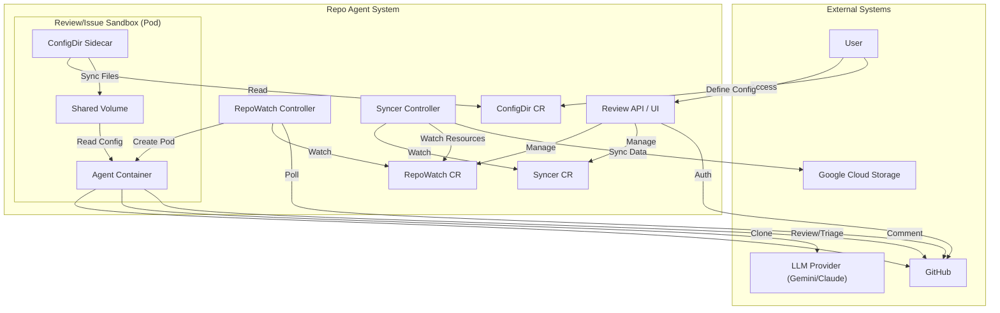

# Repo Agent Architecture

This document provides a high-level overview of the `repo-agent` architecture, its core components, and how they interact to provide automated code reviews and issue management.

## 1. Overview

`repo-agent` is a Kubernetes-native framework designed to deploy Large Language Model (LLM) agents that act as virtual developers. These agents can monitor GitHub repositories, perform code reviews on Pull Requests, triage issues, and even create fix branches in isolated development environments.

The system is built on the **Operator Pattern**, using Custom Resource Definitions (CRDs) and Controllers to manage the lifecycle of these agents.

## 2. Core Components

### 2.1. Repo Watch Controller (`repowatch-controller`)
This is a Kubernetes Controller that reconciles `RepoWatch` custom resources.
*   **Role**: Monitors GitHub repositories defined in `RepoWatch` CRs.
*   **Mechanism**: Polling (configurable interval).
*   **Responsibilities**:
    *   Detects new Pull Requests and Issues.
    *   Creates and manages the lifecycle of **Sandboxes** (Review, Issue, Dev) to handle these events.
    *   Ensures concurrency limits (e.g., "max 3 active reviews").
    *   Cleans up resources (scales down or deletes old sandboxes).

### 2.2. Sandboxes
Sandboxes are the "workers" where the actual LLM logic executes. They are ephemeral Pods (managed via deployments/CRs) that provide an isolated environment for the agent.

*   **Review Sandbox**: Created for each PR to perform code reviews.
    *   Clones the repo at the PR's commit.
    *   Downloads the diff.
    *   Invokes the configured LLM (e.g., Gemini) with a prompt containing the diff and coding standards.
    *   Parses the LLM's response into GitHub comments.
    *   Includes a `configdir-cli` sidecar to sync project-specific configurations (prompts, tools).
*   **Issue Sandbox**: Created for issue triage or resolution.
    *   Can clone the repo to understand context.
    *   Suggests labels, comments, or even code fixes.
*   **Dev Sandbox**: A persistent development environment (often with a web-based IDE like code-server) for human-agent collaboration or complex multi-turn agent tasks.

### 2.3. Review UI and API (`review-ui`)
The user interface and backend API for the system.
*   **Role**: Provides a dashboard for users to manage their agents and view status.
*   **Key Features**:
    *   **Dashboard**: View active repositories, recent reviews, and agent status.
    *   **Authentication**: Handles GitHub OAuth flow and session management (using stateless cookie sessions).
    *   **Interactive Review**: Allows users to "chat" with the agent about a specific review or override its decisions.
    *   **Proxy**: Proxies traffic to active Dev Sandboxes (e.g., accessing the VS Code instance running inside a pod).

### 2.4. ConfigDir
A mechanism to project configuration files (like prompts, tool definitions, linting rules) into the sandboxes.
*   **CRD**: `ConfigDir` defines a set of files and their sources (Inline, ConfigMap, Secret, URL).
*   **Sidecar**: A `configdir-cli` container runs in every sandbox pod to watch these resources and sync them to a shared volume, ensuring the agent always has the latest configuration.
*   **CLI**: The `configdir-cli` tool can also be used to sync a local directory to a `ConfigDir` CR in the cluster.

### 2.5. Syncer Controller (`syncer-controller`)
A controller responsible for syncing Kubernetes resources to Google Cloud Storage (GCS).
*   **CRD**: `Syncer` defines which resources (Group, Version, Kind, Namespace, Label Selector) to watch.
*   **Role**: Watches the specified resources and uploads their state to a GCS bucket. This is useful for auditing, data collection, or cross-cluster observability.

## 3. Data Flow

### Code Review Workflow
1.  **Event Detection**: The `repowatch-controller` polls GitHub and detects a new PR on a watched repository.
2.  **Sandbox Provisioning**: The controller creates a `ReviewSandbox` CR in the user's namespace.
3.  **Pod Startup**:
    *   The `ReviewSandbox` controller creates a Kubernetes Pod.
    *   The `configdir-cli` sidecar syncs prompts and tools to `/etc/gemini` (shared volume).
    *   The main agent container clones the repository.
4.  **Analysis**: The agent container reads the diff and sends it to the configured LLM provider (Gemini, Claude, etc.) along with the prompts.
5.  **Action**: The LLM returns a structured review (YAML/JSON). The agent parses this and posts review comments to GitHub via the GitHub API.
6.  **Cleanup**: The controller scales down the sandbox after the review is complete or after a timeout.

## 4. Multi-Tenancy and Isolation

The system supports multiple users through a namespace-per-tenant model.
*   **Isolation**: Each user gets their own namespace. All their `RepoWatch` resources, Sandboxes, and Secrets reside there.
*   **Security**: Service Accounts are scoped to the user's namespace.
*   **User Context**: The UI ensures users only see and manage their own resources.

For a detailed deep-dive into the tenancy model, please see [Multi-Tenant Architecture](tenancy.md).

## 5. Directory Structure

*   `repo-agent/repowatch`: Controller logic for monitoring repos.
*   `repo-agent/review-ui`: The web dashboard and API.
*   `repo-agent/review-sandbox`: The agent code that runs inside review pods.
*   `repo-agent/configdir`: The ConfigDir CRD and sidecar logic.
*   `repo-agent/syncer`: The Syncer CRD and controller logic.
*   `repo-agent/pkg/llm`: Shared library for interacting with LLM providers.
