# Repo Agent UI Design System

> Design system and theming reference for the Repo Agent review UI.
> Covers color tokens, typography, component patterns, and layout specs.

## Screenshots

### Dark Theme

| Login | Review | Issues | Dev | Settings | Add Repo |
|-------|--------|--------|-----|----------|----------|
| 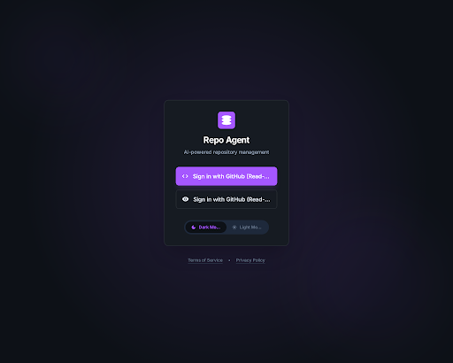 | 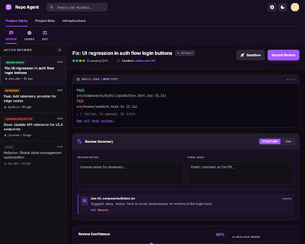 | 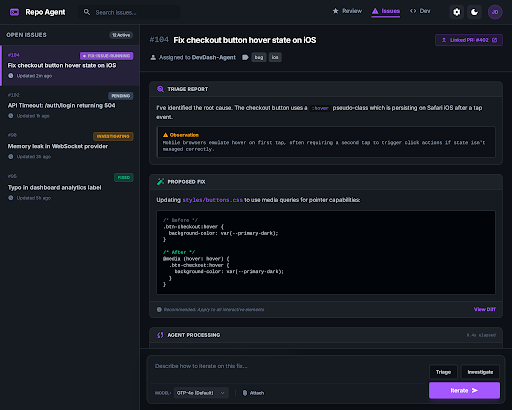 | 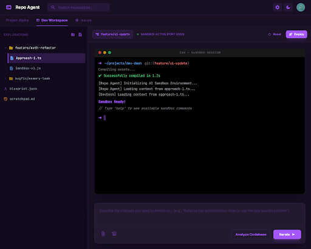 | 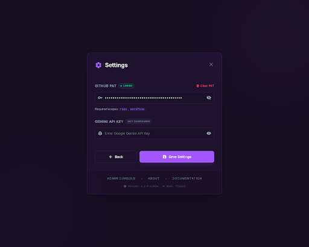 | 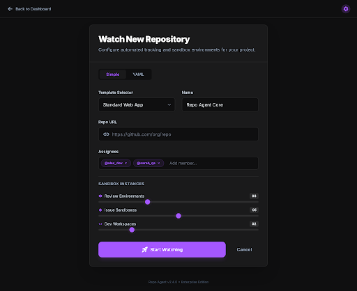 |

### Light Theme

| Login | Review | Issues | Dev | Settings | Add Repo |
|-------|--------|--------|-----|----------|----------|
| 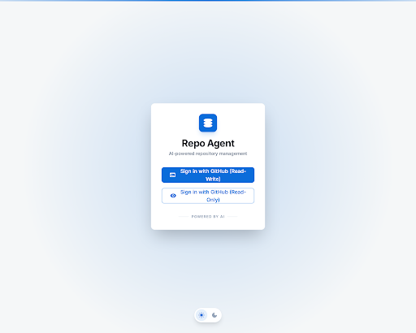 | 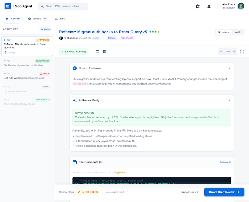 | 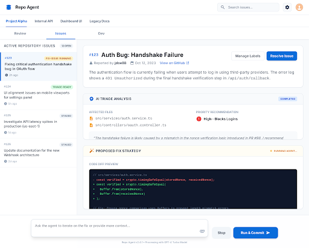 | 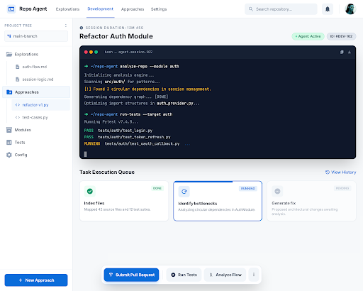 | 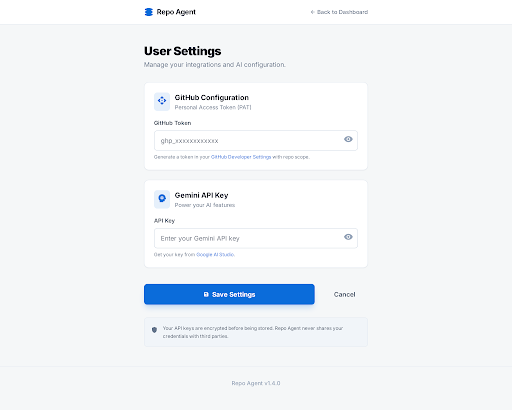 | 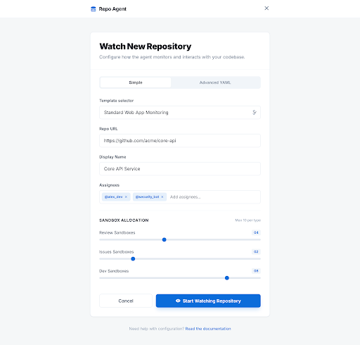 |

---

## Brand Identity

- **App Name**: Repo Agent
- **Tagline**: AI-powered repository management
- **Logo Icon**: Custom SVG — stacked ellipses forming a layered database/agent symbol, rendered in white on primary-colored rounded square (12px radius)
- **Logo Dimensions**: 48px icon + "Repo Agent" wordmark at 18px bold

---

## Color Palette

### Dark Theme (Default)

| Role | Token | Hex | Usage |
|---|---|---|---|
| **Primary** | `--color-primary` | `#a557ff` | Buttons, active tabs, links, focus rings, accents |
| **Primary Hover** | `--color-primary-hover` | `#a557ff` at 90% opacity | Button hover states |
| **Primary Subtle** | `--color-primary-subtle` | `#a557ff` at 5-20% opacity | Selected backgrounds, badges, glow effects |
| **Background Page** | `--color-bg-page` | `#0d1117` | Root page background |
| **Background App** | `--color-bg-app` | `#180f23` | Header, nav, app-level surfaces (purple-tinted variant) |
| **Background Surface** | `--color-bg-surface` | `#161b22` | Cards, panels, elevated content |
| **Background Sidebar** | `--color-bg-sidebar` | `#141018` | Sidebar backgrounds, sunken areas |
| **Background Input** | `--color-bg-input` | `#141018` | Form inputs, textareas |
| **Background Hover** | `--color-bg-hover` | `rgba(255,255,255,0.05)` | Hover states on list items |
| **Background Terminal** | `--color-bg-terminal` | `#0d0912` | Terminal/log viewer backgrounds |
| **Background Code** | `--color-bg-code` | `#1e142b` | Code blocks, terminal chrome, comment highlights |
| **Border Default** | `--color-border` | `#30363d` | Card borders, dividers, inputs |
| **Border Tinted** | `--color-border-tinted` | `#30273a` | Navigation borders (purple-tinted) |
| **Border Subtle** | `--color-border-subtle` | `#463956` | Inner dividers, scrollbar thumbs |
| **Text Primary** | `--color-text` | `#ffffff` | Headings, primary text |
| **Text Secondary** | `--color-text-secondary` | `#e2e8f0` (slate-200) | Body text, descriptions |
| **Text Muted** | `--color-text-muted` | `#aa9abc` | Labels, timestamps, helper text |
| **Text Dim** | `--color-text-dim` | `#94a3b8` (slate-400) | Placeholder text, disabled |

### Light Theme

| Role | Token | Hex | Usage |
|---|---|---|---|
| **Primary** | `--color-primary` | `#0b6cda` | Buttons, active tabs, links, focus rings |
| **Primary Hover** | `--color-primary-hover` | `#0b6cda` at 90% opacity | Button hover states |
| **Primary Subtle** | `--color-primary-subtle` | `#0b6cda` at 5-10% opacity | Selected backgrounds, badges |
| **Background Page** | `--color-bg-page` | `#f5f7f8` | Root page background |
| **Background Surface** | `--color-bg-surface` | `#ffffff` | Cards, panels, header |
| **Background Input** | `--color-bg-input` | `#f8fafc` (slate-50) | Form inputs, textareas |
| **Background Hover** | `--color-bg-hover` | `#f1f5f9` (slate-100) | Hover states |
| **Border Default** | `--color-border` | `#e2e8f0` (slate-200) | Card borders, dividers |
| **Border Subtle** | `--color-border-subtle` | `#f1f5f9` (slate-100) | Inner section dividers |
| **Text Primary** | `--color-text` | `#0f172a` (slate-900) | Headings, primary text |
| **Text Secondary** | `--color-text-secondary` | `#334155` (slate-700) | Body text |
| **Text Muted** | `--color-text-muted` | `#64748b` (slate-500) | Labels, timestamps |
| **Text Dim** | `--color-text-dim` | `#94a3b8` (slate-400) | Placeholders, disabled |

### Semantic Status Colors (Both Themes)

| Status | Color | Dark BG | Usage |
|---|---|---|---|
| **Success / Active** | `#22c55e` (green-500) | `rgba(34,197,94,0.1)` | Active sandbox, CI passed, review ready |
| **Warning / Running** | `#f59e0b` (amber-500) | `rgba(245,158,11,0.1)` | Reviewing, in-progress, CI running |
| **Error / Failed** | `#ef4444` (red-500) | `rgba(239,68,68,0.1)` | Error, failed CI, changes requested |
| **Info / Provisioning** | `#3b82f6` (blue-500) | `rgba(59,130,246,0.1)` | Provisioning, info states |
| **Draft** | `#64748b` (slate-500) | `rgba(100,116,139,0.1)` | Draft PRs, disabled states |

---

## Typography

### Font Families

| Role | Font | Fallback | Usage |
|---|---|---|---|
| **Display / UI** | `Inter` | `-apple-system, BlinkMacSystemFont, "Segoe UI", sans-serif` | All UI text |
| **Monospace** | `JetBrains Mono` | `"Fira Code", "SF Mono", Consolas, monospace` | Terminal, code, YAML, commit hashes |

### Type Scale

| Level | Size | Weight | Line Height | Usage |
|---|---|---|---|---|
| **Page Title** | 24px (`text-2xl`) | 700 (bold) | tight | Login heading, page titles |
| **Section Title** | 20px (`text-xl`) | 700 (bold) | tight | PR title in detail view |
| **Card Title** | 14px (`text-sm`) | 700 (bold) | snug | Card headings, sidebar item titles |
| **Body** | 14px (`text-sm`) | 400 (normal) | normal | General text, descriptions |
| **Small / Meta** | 12px (`text-xs`) | 400-500 | normal | Timestamps, author names, helper text |
| **Label** | 10-11px | 700 (bold) | normal | Uppercase tracking-widest labels, section headers |
| **Badge** | 10px | 700 (bold) | normal | Status flair text, count badges |

### Text Styles

- **Section labels**: `text-[10px] font-bold uppercase tracking-widest text-muted` — e.g., "ACTIVE REVIEWS", "REVIEW NOTES", "AI ANALYSIS MODEL"
- **Tab labels**: `text-[11px] font-bold uppercase tracking-wider` — e.g., "REVIEW", "ISSUES", "DEV"
- **Commit hashes**: `font-mono text-xs` in muted pill — e.g., `8f2a1c9`

---

## Spacing System

Base unit: **4px** (Tailwind default)

| Token | Value | Usage |
|---|---|---|
| `gap-1` | 4px | Tight inline groups (CI dots) |
| `gap-2` | 8px | Button groups, icon-text pairs |
| `gap-3` | 12px | Card content items |
| `gap-4` | 16px | Section spacing, form fields |
| `gap-6` | 24px | Major section spacing |
| `gap-8` | 32px | Tab navigation gaps, page section padding |
| `p-3` | 12px | Compact card padding, inputs |
| `p-4` | 16px | Standard sidebar item padding |
| `p-5` | 20px | Card content areas |
| `p-6` | 24px | Main panel padding, header padding |
| `p-8` | 32px | Login card, modal padding |
| `px-6 py-3` | 24px/12px | Header bar padding |

---

## Border Radius

| Token | Value | Usage |
|---|---|---|
| `rounded` | 4px | Small badges, status pills |
| `rounded-lg` | 8px | Buttons, inputs, search bar, icon buttons |
| `rounded-xl` | 12px | Cards, panels, modals, terminal blocks |
| `rounded-full` | 9999px | Avatars, pill toggles, count badges, CI dots |

---

## Shadows

| Name | Value | Usage |
|---|---|---|
| **Card** | `shadow-sm` | Standard cards, panels |
| **Elevated** | `shadow-lg` | Floating elements, theme toggle |
| **Modal** | `shadow-2xl` | Login card, modals, overlays |
| **Primary Glow** | `shadow-lg shadow-primary/20` | Primary action buttons |

---

## Component Library

### Buttons

| Variant | Dark Mode | Light Mode | Usage |
|---|---|---|---|
| **Primary** | `bg-primary hover:bg-primary/90 text-white font-bold rounded-lg shadow-lg shadow-primary/20` | Same | Main CTA: "Submit Review", "Start Watching", "Save Settings" |
| **Secondary / Ghost** | `bg-[#30273a] hover:bg-[#463956] text-white rounded-lg font-bold` | `bg-slate-100 hover:bg-slate-200 text-slate-700` | "Sandbox", icon buttons |
| **Outlined** | `border-2 border-primary text-primary hover:bg-primary hover:text-white rounded-lg font-bold` | Same | "Run AI Review Again", "Cancel" |
| **Danger** | `text-red-400 hover:underline` | `text-red-500` | "Remove", "Clear PAT", "Delete" |
| **Icon Button** | `size-9 bg-[#30273a] rounded-lg flex items-center justify-center text-white` | `size-9 bg-slate-100 rounded-lg text-slate-600` | Settings gear, theme toggle |

**Button sizing**: Height `h-9` to `h-12`, padding `px-4 py-2` standard, `px-6 py-2.5` large

### Status Flair Badges

Small uppercase pill badges indicating state:

```html
<!-- Review Ready (green) -->
<span class="text-[10px] font-bold uppercase text-green-500 bg-green-500/10 px-1.5 py-0.5 rounded">Review Ready</span>

<!-- Reviewing (amber) -->
<span class="text-[10px] font-bold uppercase text-amber-500 bg-amber-500/10 px-1.5 py-0.5 rounded">Reviewing</span>

<!-- Error (red) -->
<span class="text-[10px] font-bold uppercase text-red-500 bg-red-500/10 px-1.5 py-0.5 rounded">Changes Requested</span>

<!-- Draft (gray) -->
<span class="text-[10px] font-bold uppercase text-slate-500 bg-slate-500/10 px-1.5 py-0.5 rounded">Draft</span>

<!-- Running (amber, pulsing) -->
<span class="text-[10px] font-bold uppercase text-amber-500 bg-amber-500/10 px-1.5 py-0.5 rounded animate-pulse-subtle">Running</span>
```

### Cards

```
Container: bg-surface rounded-xl border border-default shadow-sm overflow-hidden
Header bar: p-4 border-b bg-white/5 (dark) or bg-slate-50/50 (light), flex justify-between items-center
Content area: p-5 space-y-4
```

### Sidebar List Items

```
Default: p-4 border-b cursor-pointer transition-colors hover:bg-hover
Selected: bg-primary/5 border-l-4 border-l-primary
```

### Form Inputs

```html
<input class="w-full bg-input border border-default rounded-lg p-3 text-sm
  focus:ring-1 focus:ring-primary focus:border-primary
  placeholder:text-dim" />

<textarea class="w-full h-24 bg-input border border-default rounded-lg p-3 text-sm
  focus:ring-1 focus:ring-primary focus:border-primary resize-none" />

<select class="w-full bg-surface border border-default rounded-lg px-3 py-2 text-sm
  appearance-none focus:ring-primary focus:border-primary" />
```

### Tab Navigation

**Repo tabs (top level)**:
```
Active: border-b-2 border-primary text-primary pb-3 pt-4 text-sm font-bold
Inactive: border-b-2 border-transparent text-muted text-sm font-bold hover:text-primary
```

**Sub-tabs (Review/Issues/Dev)**:
```
Active: border-b-[3px] border-primary text-primary with icon + uppercase label
Inactive: border-b-[3px] border-transparent text-muted hover:text-primary
```

**Pill toggle (Structured/YAML)**:
```
Container: p-1 bg-input rounded-lg flex gap-2
Active: px-3 py-1 rounded bg-primary text-white shadow-sm
Inactive: px-3 py-1 text-muted
```

### CI Status Dots

```html
<div class="flex items-center gap-1">
  <span class="w-2.5 h-2.5 rounded-full bg-green-500"></span>  <!-- passed -->
  <span class="w-2.5 h-2.5 rounded-full bg-green-500"></span>  <!-- passed -->
  <span class="w-2.5 h-2.5 rounded-full bg-amber-500"></span>  <!-- running -->
  <span class="w-2.5 h-2.5 rounded-full bg-green-500"></span>  <!-- passed -->
  <span class="text-xs text-muted ml-1">CI passing (3/4)</span>
</div>
```

### Terminal / Log Viewer

```
Chrome bar: bg-code px-4 py-2 border-b, with dots (w-2 h-2 rounded-full bg-border-subtle)
Content: bg-terminal p-4 font-mono text-sm leading-relaxed
Colors: green-400 for PASS, red-400 for FAIL, slate-400 for paths, primary for highlights, slate-500 for meta
```

### Comment Cards (Review)

```
Container: bg-code p-3 rounded-lg border-l-4 border-l-primary/50
Icon: bg-primary/20 p-1.5 rounded-lg text-primary
File ref: text-xs font-bold text-secondary
Comment: text-sm text-muted
Actions: text-[11px] font-bold — "Edit" in primary, "Remove" in red-400
```

### Count Badge

```html
<span class="bg-primary/10 text-primary text-[10px] px-2 py-0.5 rounded-full font-bold">12</span>
```

### Linked PR Badge

```html
<span class="inline-flex items-center gap-1 px-2 py-1 bg-blue-500/10 text-blue-400 rounded text-xs font-bold">
  Linked PR #402
  <span class="material-symbols-outlined text-xs">open_in_new</span>
</span>
```

---

## Layout Patterns

### Split Panel (Review & Issues Tabs)

```
Container: flex-1 flex overflow-hidden
Sidebar: w-[280px] border-r flex flex-col bg-sidebar, overflow-y-auto custom-scrollbar
Main: flex-1 flex flex-col bg-page, overflow-y-auto p-6 space-y-6
```

### Two-Panel Resizable (Dev Tab)

```
Container: flex-1 flex overflow-hidden
Left: w-[360px] min-w-[200px] max-w-[600px] bg-sidebar, resizable via drag handle
Divider: 3px cursor-col-resize
Right: flex-1 p-6
```

### Centered Card (Login, Settings, Add Repo)

```
Container: min-h-screen flex flex-col items-center justify-center
Card: w-full max-w-[400px] bg-surface rounded-xl shadow-2xl border p-8
```

### Page Header

```
Header: flex items-center justify-between px-6 py-3 bg-surface border-b
  Left: logo icon + app name + search bar
  Right: icon buttons (settings, theme) + user avatar
Height: ~48px
```

---

## Icons

**Library**: Google Material Symbols Outlined
**Import**: `https://fonts.googleapis.com/css2?family=Material+Symbols+Outlined:wght,FILL@100..700,0..1`
**Size classes**: `text-xs` (12px), `text-sm` (14px), `text-lg` (18px), `text-xl` (20px), `text-base` (16px)

### Key Icons Used

| Icon | Material Symbol | Context |
|---|---|---|
| Terminal | `terminal` | Dev tab, terminal toggle, logo |
| Review | `reviews` | Review tab icon |
| Issues | `error` | Issues tab icon |
| Search | `search` | Search bar |
| Settings | `settings` | Settings button |
| Dark Mode | `dark_mode` | Theme toggle |
| Light Mode | `light_mode` | Theme toggle |
| Person | `person` | Author attribution |
| Commit | `commit` | Commit hash display |
| Sandbox | `data_object` | Sandbox status |
| Chat | `chat` | Review comments |
| Edit | `edit_note` | Review summary |
| Refresh | `refresh` | Re-run review |
| Rocket | `rocket_launch` | Sandbox action |
| Expand | `expand_more` | Dropdown arrow |
| Open External | `open_in_new` | External links |
| Code | `code` | GitHub sign-in |
| Visibility | `visibility` | Read-only sign-in |
| Deploy | `deployed_code` | Deploy button |
| Folder | `folder` | Exploration groups |
| File | `description` | Approach files |

---

## Animations & Transitions

| Name | Value | Usage |
|---|---|---|
| **Default Transition** | `transition-colors` (200ms) | Button hover, tab hover |
| **All Transition** | `transition-all duration-200` | Buttons with scale/shadow changes |
| **Active Press** | `active:scale-[0.98]` | Button press feedback (light theme) |
| **Pulse Subtle** | `@keyframes pulse-subtle { 0%,100% { opacity:1 } 50% { opacity:0.7 } }` 2s infinite | Running/processing status badges |

---

## Custom Scrollbar

```css
.custom-scrollbar::-webkit-scrollbar { width: 4-6px; }
.custom-scrollbar::-webkit-scrollbar-track { background: transparent; }
.custom-scrollbar::-webkit-scrollbar-thumb { background: #30363d; border-radius: 10px; }
.custom-scrollbar::-webkit-scrollbar-thumb:hover { background: #a557ff; }
```

---

## Background Effects

### Radial Glow (Login)
```css
/* Dark */
background: radial-gradient(circle at center, rgba(165, 87, 255, 0.15) 0%, rgba(13, 17, 23, 0) 70%);

/* Light */
background: radial-gradient(circle at center, #0b6cda 0%, transparent 70%);
opacity: 0.2;
```

### Decorative Blurs (Login)
```html
<div class="absolute w-64 h-64 bg-primary/5 rounded-full blur-3xl pointer-events-none"></div>
```

---

## Tailwind Configuration

```javascript
tailwind.config = {
  darkMode: "class",
  theme: {
    extend: {
      colors: {
        "primary": "#a557ff",           // Dark theme primary
        // "primary": "#0b6cda",        // Light theme primary (swap per mode)
        "background-light": "#f5f7f8",
        "background-dark": "#0d1117",
        "surface-dark": "#161b22",
        "border-dark": "#30363d",
        "charcoal-muted": "#161b22",
        "charcoal-border": "#30363d",
      },
      fontFamily: {
        "display": ["Inter", "sans-serif"],
        "mono": ["JetBrains Mono", "monospace"],
      },
      borderRadius: {
        "DEFAULT": "0.25rem",
        "lg": "0.5rem",
        "xl": "0.75rem",
        "full": "9999px",
      },
    },
  },
}
```

---

## Screen Inventory

| # | Screen | ID | Theme | Key Components |
|---|---|---|---|---|
| 1 | Login | `6c007e24dc564d32a54ef6b696a07fd9` | Dark | Centered card, OAuth buttons, theme toggle pill |
| 2 | Review Tab | `6cb4fc7cd09046e59ef100c69487763f` | Dark | Split layout, PR sidebar, review card, terminal, diff comments |
| 3 | Issues Tab | `607864b8f6314a9eb6a08dd7bf806320` | Dark | Split layout, issue sidebar, triage report, code diff, action bar |
| 4 | Dev Tab | `d372833e39184b74857058a8fd112f7b` | Dark | Two-panel, tree sidebar, terminal, task queue |
| 5 | Settings | `cbc2910863314f3180441f64dde725b4` | Dark | Centered modal card, PAT/API key inputs, status badges |
| 6 | Add Repo | `afb77d33574c41708d57920f0ee3f998` | Dark | Centered card, template selector, sliders, simple/YAML toggle |
| 7 | Review Tab (Light) | `26f3a2912bfa413d88a9bac1827d1892` | Light | Same layout, blue primary, white surfaces |
| 8 | Login (Light) | `2794c866b549451c9cc58807d1285e40` | Light | Same layout, blue primary, subtle gradient |
| 9 | Issues Tab (Light) | `c794da9643d64c5995c3d284e437ff54` | Light | Same layout, blue primary, white cards |
| 10 | Dev Tab (Light) | `0a8beb4d21694190a9b4a625096dc66a` | Light | Same layout, blue primary, sidebar tree |
| 11 | Settings (Light) | `fcfc9144f0104f12935b3f1e73c1a6ed` | Light | Centered page, clean card sections |
| 12 | Add Repo (Light) | `f7fbf3f8198f4a38b1a98c8181027b2d` | Light | Centered card, clean form fields |

---

## Design Notes

1. **Dual Primary Colors**: Dark mode uses purple (`#a557ff`), light mode uses blue (`#0b6cda`). This creates distinct visual identities per theme while maintaining the same structural patterns.
2. **Dark Mode Purple Tinting**: Dark mode surfaces use subtle purple-tinted darks (e.g., `#180f23`, `#30273a`, `#1e142b`) rather than pure neutral grays, giving the dark theme warmth and brand cohesion.
3. **Status System**: Consistent across all screens — green/amber/red/blue/gray with 10% opacity backgrounds for badges.
4. **Split Layout Pattern**: Review and Issues tabs share identical sidebar (280px) + main panel architecture for consistency.
5. **Terminal Integration**: Embedded terminal panels use a distinct deeper background (`#0d0912`) to visually separate from card surfaces.
6. **Progressive Disclosure**: Collapsible sections ("Pending", "Excluded", task cards) reduce visual noise while keeping all information accessible.
