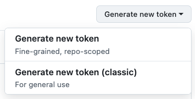
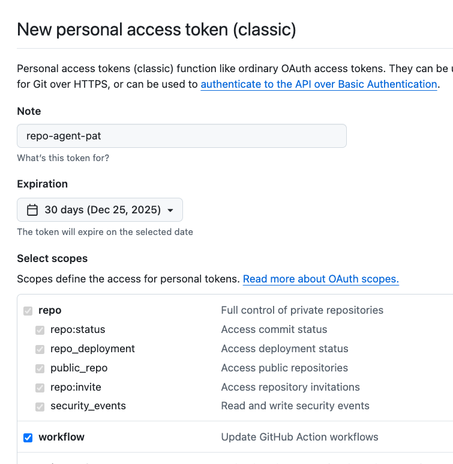
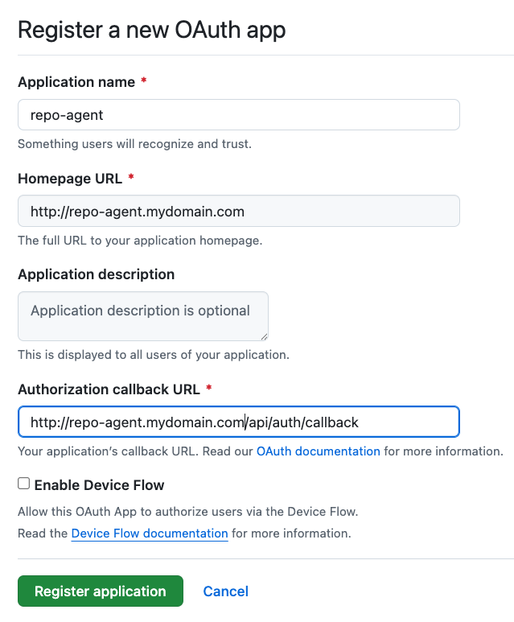

## Set Environment Variables

There are 2 installation modes for the repo-agent:

1. single-user: with your personal cluster (like kind)
2. multi-user: Shared cluster hosting it for others to use.

We need these basic tokens for both the installation modes:

1. `GEMINI_API_KEY` is used with `gemini-cli` to generate reviews or bug fixes
2. `GITHUB_PAT` is used to make API calls to poll for Pull Requests, Issues etc. It is also used to create Draft reviews and code branches.
3. `GITHUB_BOT_LOGIN` (optional) is the GitHub username of the bot. Used to skip duplicate reviews.

Export your Gemini API key, GitHub Personal Access Token, and (optional) Bot Login as environment variables:

```bash
export GEMINI_API_KEY="..."
export GITHUB_PAT="..."
export GITHUB_BOT_LOGIN="..."
```

When installing for multi-user case, we need these additional tokens. This allows enbaling login using github for the users.

1. `GITHUB_CLIENT_SECRET`
2. `GITHUB_CLIENT_ID`

```bash
export GITHUB_CLIENT_SECRET="..."
export GITHUB_CLIENT_ID="..."
```

### Getting GITHUB PAT

Github personal access token can be obtained by naviagating to https://github.com/settings/tokens

**1. Select "Generate New Token (classic)":**



**2. Fillout the New PAT fields:**



Copy and save the PAT securely.

### Getting GITHUB CLIENT SECRET, ID

For generating the repo-agent OAuth App tokens, navigate to https://github.com/settings/developers

**1. Click New OAuth App**


**2. Fill out the form**

You would need a domain from which you will access the repo-agent.



If testing locally with portforward, you can set URL to `http://localhost:13380/`.  
Please note the Oauth App can be edited later to change the URLs.